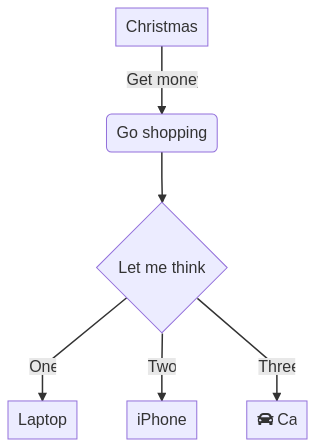

* Package things!
#+begin_src emacs-lisp
  (defvar es/init-timer-start (current-time))
  (defvar es/init-timer-last es/init-timer-start)
  (defun es/init-timer (label)
    "Log elapsed init time for LABEL."
    (let* ((now (current-time))
           (total (float-time (time-subtract now es/init-timer-start)))
           (delta (float-time (time-subtract now es/init-timer-last))))
      (setq es/init-timer-last now)
      (message "init-timer: %6.2fs total, %6.2fs delta - %s"
               total delta label)))
  (es/init-timer "start")
#+end_src
This is a bit of fumbling to try and get this all to work on a new computer from zero with minimal manual intervention.
#+begin_src emacs-lisp
  (require 'package)
  (setq load-prefer-newer t)
  (setq package-install-upgrade-built-in t)
  (setq package-user-dir (expand-file-name "~/.emacs.d/elpa"))
  (setq package-archives
        '(("gnu" . "https://elpa.gnu.org/packages/")
          ("nongnu" . "https://elpa.nongnu.org/nongnu/")
          ("melpa" . "https://melpa.org/packages/")))
  (setq package-archive-priorities
        '(("gnu" . 30)
          ("nongnu" . 20)
          ("melpa" . 10)))
  (setq package-pinned-packages
        '((org . "gnu")
          (org-contrib . "nongnu")
          (cond-let . "melpa")))
  (package-initialize t)

  (when (not package-archive-contents)
    (package-refresh-contents))
  (es/init-timer "package initialize")
#+end_src
#+BEGIN_SRC emacs-lisp
  (defconst es/minimum-org-version "9.7.19")
  (defconst es/minimum-compat-version "29.1.4.1")
  (defconst es/minimum-cond-let-version "20260201.1500")
  (defconst es/minimum-transient-version "0.12.0")

  (defun es/package-version-string (desc)
    "Return DESC version as a string."
    (package-version-join (package-desc-version desc)))

  (defun es/find-installed-package-desc (name)
    "Return the newest installed package descriptor for NAME."
    (car (sort (mapcar #'cadr (seq-filter (lambda (pkg) (eq (car pkg) name))
                                          package-alist))
               (lambda (a b)
                 (version-list-< (package-desc-version b)
                                 (package-desc-version a))))))

  (defun es/activate-package-desc (desc)
    "Prefer DESC on `load-path' for the current Emacs session."
    (when desc
      (let ((dir (package-desc-dir desc)))
        (setq load-path (cons dir (delete dir load-path))))))

  (defun es/package-source-file (name file)
    "Return FILE inside the installed package NAME directory."
    (let ((desc (es/find-installed-package-desc name)))
      (when desc
        (expand-file-name file (package-desc-dir desc)))))

  (defun es/find-archive-package-desc (name)
    "Return the archive descriptor for NAME, if present."
    (cadr (assoc name package-archive-contents)))

  (defun es/ensure-package-at-least (name minimum-version)
    "Install NAME at MINIMUM-VERSION and prefer it in this session."
    (let* ((installed-desc (es/find-installed-package-desc name))
           (installed-version (and installed-desc
                                   (es/package-version-string installed-desc))))
      (when (or (null installed-desc)
                (version< installed-version minimum-version))
        (unless package-archive-contents
          (package-refresh-contents))
        (when (and installed-desc
                   (version< installed-version minimum-version))
          (message "Replacing old %s package %s" name installed-version)
          (package-delete installed-desc t))
        (let ((package-load-list '(all)))
          (package-install name))
        (setq installed-desc (es/find-installed-package-desc name)))
      (es/activate-package-desc installed-desc)
      installed-desc))

  (defun es/ensure-org-package ()
    "Install a new enough Org package and prefer it in this session."
    (es/ensure-package-at-least 'org es/minimum-org-version))

  (defun es/ensure-compat-package ()
    "Install a new enough Compat package and prefer it in this session."
    (es/ensure-package-at-least 'compat es/minimum-compat-version))

  (defun es/ensure-cond-let-package ()
    "Install a new enough Cond-let package and prefer it in this session."
    (es/ensure-package-at-least 'cond-let es/minimum-cond-let-version))

  (defun es/ensure-transient-package ()
    "Install a new enough Transient package and prefer it in this session."
    (es/ensure-package-at-least 'transient es/minimum-transient-version))

  (unless (package-installed-p 'use-package)
    (package-install 'use-package))
  (eval-when-compile
    (require 'use-package))

  (es/ensure-compat-package)
  (require 'compat nil t)
  (let ((compat-30-file (es/package-source-file 'compat "compat-30.el")))
    (when compat-30-file
      (load-file compat-30-file)))
  (es/ensure-cond-let-package)
  (require 'cond-let nil t)
  (es/ensure-org-package)
  (require 'org)
  (require 'org-id)
  (es/ensure-transient-package)
  (require 'transient)
  (package-activate-all)
  (es/init-timer "package version checks and org/transient load")
#+END_SRC
Make use package always install if package is not installed.
#+begin_src emacs-lisp
  (setq use-package-always-ensure t)
#+end_src

Ubuntu specific (hopefully this doesn't break mac!) - this forces org to update to a later version.
#+BEGIN_SRC emacs-lisp
  ;;(use-package org :ensure org-contrib :pin org)
  (use-package org :ensure nil)
#+END_SRC

This brings back the old "<s" shortcut for source blocks. Unfortunately it has different casing than before, but that's not worth the time to fix (probably easy though).
#+begin_src emacs-lisp
  (require 'org-tempo)
  (es/init-timer "org base setup")
#+end_src

* Extra Plugins
** Evil
Because I am a vim user at heart.
*** Fix tab cycling
Remove evil C-i binding so tab works.
#+begin_src emacs-lisp
  (setq evil-want-keybinding nil)
  (setq evil-want-C-i-jump nil)
#+end_src
See [[*Evil jumplist remapping][Evil jumplist remapping]] for where the rebind happens.
** Helm
Load Helm before the Evil blocks so `M-x` is still rebound even if an Evil package blows up during init.
#+begin_src emacs-lisp
  (use-package helm
    :ensure t
    :config
    (setq helm-split-window-in-side-p t
          helm-move-to-line-cycle-in-source t)
    (helm-mode 1)
    (global-set-key (kbd "M-x") 'helm-M-x))
  (es/init-timer "helm")
#+end_src
*** Use package wih org bindings
Set up org bindings first. Honestly not sure if this needs to come before use evil, but not worth figuring out.
#+BEGIN_SRC emacs-lisp
  (use-package evil
    :ensure t
    :demand t
    :config
    (evil-mode 1))

  (use-package evil-org
    :ensure t
    :after (evil org)
    :hook (org-mode . (lambda () evil-org-mode))
    :config
    (require 'evil-org-agenda)
    (evil-org-agenda-set-keys))
  (es/init-timer "evil and evil-org")
#+END_SRC
*** Bar cursor
Change cursor to a bar in insert mode.
#+begin_src emacs-lisp
  (use-package evil-terminal-cursor-changer
    :config
    (unless (display-graphic-p)
      (require 'evil-terminal-cursor-changer)
      (evil-terminal-cursor-changer-activate))) ; or (etcc-on)
  (setq evil-default-cursor (quote (t "cyan"))
        evil-visual-state-cursor '("cyan" box)
        evil-normal-state-cursor '("cyan" box)
        evil-operator-state-cursor '("cyan" box)
        evil-emacs-state-cursor '("cyan" box)
        ;;evil-normal-state-cursor '("cyan" box)
        ;;evil-insert-state-cursor '("cyan" bar)
        )

#+end_src
*** Evil surround
#+begin_src emacs-lisp
  (use-package evil-surround
    :ensure t
    :config
    (global-evil-surround-mode 1))

#+end_src
*** Easymotion
#+begin_src emacs-lisp
  (use-package evil-easymotion
    :config
    (evilem-default-keybindings "SPC"))

#+end_src
** Find lisp
#+begin_src emacs-lisp
  (use-package find-lisp)

#+end_src
** TODO Smartparens
Doesn't quite work yet - Maybe I'll get it going some day.
#+begin_src emacs-lisp
  ;;   (use-package smartparens)
  ;; (use-package evil-smartparens)
  ;; (add-hook 'smartparens-enabled-hook #'evil-smartparens-mode)

#+end_src
** Magit
Definitely pronounced "muh git", much like "muh queen". Certainly not "mahjit", despite what the top hat and wand would make you think.
#+begin_src emacs-lisp
  (use-package magit)
  (es/init-timer "magit")
#+end_src
*** Evil magit
Get keybindings for evil in magit mode.
Not sure what else evil-collection has, but some day I want to move this elsewhere if it's spanning across other modes.
#+begin_src emacs-lisp
  (use-package evil-collection
    :config
    (evil-collection-init 'magit))
  (es/init-timer "evil-collection magit")
#+end_src
*** Forge
To work with github
#+begin_src emacs-lisp
  ;;(use-package forge
    ;;:after magit)

#+end_src
** Undo Tree
I could have sworn I had this installed at one point, but oh well!
#+begin_src emacs-lisp
  (use-package undo-tree
    :config
    (global-undo-tree-mode)
    (global-set-key (kbd "C-x C-u") 'undo-tree-visualize)
    (with-eval-after-load 'evil
      (define-key evil-ex-map "xu" 'undo-tree-visualize)))
  (es/init-timer "undo-tree")
#+end_src
Force undo tree files into local emacs d.
#+begin_src emacs-lisp
  (setq undo-tree-history-directory-alist '(("." . "~/.emacs.d/undo")))
#+end_src
** Rifle
All the other deps with the funked up deps
#+begin_src emacs-lisp
  (use-package f)
  (use-package s)
  (use-package dash)
  (use-package helm-org-rifle)
  (es/init-timer "rifle deps")
#+end_src
** Nice autocompletion things
Much of this I just followed [[https://org-roam.discourse.group/t/how-to-to-get-title-of-the-target-note-working-with-inline-autocomplete-in-org-roam/782][this guide while trying to configure Roam]]
Smart parents
#+begin_src emacs-lisp
  (use-package smartparens
    :config
    (smartparens-global-mode t))

#+end_src
Company
#+begin_src emacs-lisp
  (use-package company
    :config
    (add-hook 'after-init-hook 'global-company-mode)
    (setq company-minimum-prefix-length 2)
    (setq company-idle-delay 0.25)
    (add-to-list 'company-backends 'company-capf))
  (es/init-timer "company")

#+end_src
Completion config
#+begin_src emacs-lisp
  (setq completion-ignore-case t)

#+end_src
*** TODO Helm fuzzier matching
Doesn't quite work yet - I'm trying to get it so that I can fuzzy match
in helm-apropos, but despite what the internet says it is not working.
#+begin_src emacs-lisp
  ;; (use-package helm-fuzzier)
  ;; (helm-fuzzier-mode 1)

#+end_src
** K8s
Not using k8s a ton day to day, but a magit-like k8s buffer seems great. Going to mess around with it.
#+begin_src emacs-lisp
  (use-package kubernetes)
  (use-package kubernetes-evil
  :ensure t
  :after kubernetes)
  (fset 'k8s 'kubernetes-overview)
  (es/init-timer "kubernetes")

#+end_src
* Custom variables (I don't really remember what this is)
** env variables
#+begin_src emacs-lisp
  (setq es/org-root (getenv "ORG_ROOT"))
  (setq es/org-work-root (getenv "ORG_WORK_ROOT"))
  (defun es/find-lisp-find-files-ignore-missing-dir (orig dir regexp &rest args)
    "Return nil instead of erroring when `find-lisp-find-files' sees a missing DIR."
    (if (and dir (file-directory-p dir))
        (apply orig dir regexp args)
      nil))
  (advice-add 'find-lisp-find-files :around #'es/find-lisp-find-files-ignore-missing-dir)
  (defvar es/org-todoist-agenda-file nil)
  (defun es/org-todoist-agenda-files ()
    "Return the Todoist org file when it is configured."
    (if (and es/org-todoist-agenda-file
             (file-exists-p es/org-todoist-agenda-file))
        (list es/org-todoist-agenda-file)
      nil))
#+end_src
** Agenda and things
Variables - org agenda files, which will some day pull dates, but are also used for how things refile. I exclude archive.org from this list because it's huge.

#+BEGIN_SRC emacs-lisp
  (defun es/fourteen-days-ago-month ()
    "Lookback fourteen days ago, and format that month as YYYY-MM."
    (format-time-string "%Y-%m" (time-add (current-time) (seconds-to-time -1209600)))
    ;; debug - make this look back more to see if anything is straggling
    ;; (format-time-string "%Y-%m" (time-add (current-time) (seconds-to-time -2409600)))
    )
  (defun es/current-month ()
    "Get current month as YYYY-MM."
    (format-time-string "%Y-%m" (current-time))
    )
  (defun es/find-org-files (dir)
    "Return org files under DIR, or nil when DIR does not exist."
    (find-lisp-find-files dir "\.org$"))
  (defvar es/org-agenda-files-cache nil)
  (defvar es/org-agenda-files-cache-no-work nil)
  (defun es/reset-org-agenda-files-cache () (interactive)
         "Clear cached org agenda file lists."
         (setq es/org-agenda-files-cache nil)
         (setq es/org-agenda-files-cache-no-work nil))
  (defun es/work-org-agenda-files ()
    "Build the work-inclusive org agenda file list."
    (append
     (cl-remove-if (lambda (k) (string-match-p "archive.org" k))
                   (es/find-org-files (concat es/org-root "/projects/")))
     (cl-remove-if (lambda (k) (string-match-p "_done.org" k))
                   (es/find-org-files (concat es/org-work-root "/projects/")))
     (cl-remove-if (lambda (k) (not (or
                                     (string-match-p (es/current-month) k)
                                     (string-match-p (es/fourteen-days-ago-month) k))))
                   (es/find-org-files (concat es/org-work-root "/roam/daily")))
     (cl-remove-if (lambda (k) (not (string-match-p "inbox.org" k)))
                   (es/find-org-files es/org-root))
     (cl-remove-if (lambda (k) (not (or
                                     (string-match-p (es/current-month) k)
                                     (string-match-p (es/fourteen-days-ago-month) k))))
                   (es/find-org-files (concat es/org-root "/roam/daily/")))
     (es/org-todoist-agenda-files)))
  (defun es/no-work-org-agenda-files ()
    "Build the personal-only org agenda file list."
    (append
     (cl-remove-if (lambda (k) (string-match-p "archive.org" k))
                   (es/find-org-files (concat es/org-root "/projects/")))
     (cl-remove-if (lambda (k) (not (string-match-p "inbox.org" k)))
                   (es/find-org-files es/org-root))
     (cl-remove-if (lambda (k) (not (or
                                     (string-match-p (es/current-month) k)
                                     (string-match-p (es/fourteen-days-ago-month) k))))
                   (es/find-org-files (concat es/org-root "/roam/daily/")))
     (es/org-todoist-agenda-files)))
  (defun es/set-org-agenda-files () (interactive)
         (if es/no-work-agenda
             (es/set-no-work-org-agenda-files)
           (es/set-work-org-agenda-files)
           )
         )
  (defun es/set-work-org-agenda-files () (interactive)
         "Define my org agenda files"
         (setq-default org-agenda-files
                       (or es/org-agenda-files-cache
                           (setq es/org-agenda-files-cache
                                 (es/work-org-agenda-files)))))
  (defun es/set-nw-agenda () (interactive)
         (setq es/no-work-agenda t)
         )
  (defun es/set-yw-agenda () (interactive)
         (setq es/no-work-agenda nil)
         )
  (defun es/set-no-work-org-agenda-files () (interactive)
         "Define just personal agenda files"
         (setq-default org-agenda-files
                       (or es/org-agenda-files-cache-no-work
                           (setq es/org-agenda-files-cache-no-work
                                 (es/no-work-org-agenda-files)))))
  (es/set-yw-agenda)
  (es/init-timer "agenda file setup")
#+END_SRC
Start with bullets folded and indented by default.
#+BEGIN_SRC emacs-lisp
  (setq org-startup-indented t)
  (setq org-startup-folded t)
#+END_SRC
No clue what custom-set-faces is to be honest.
#+BEGIN_SRC emacs-lisp
  (custom-set-faces
   ;; custom-set-faces was added by Custom.
   ;; If you edit it by hand, you could mess it up, so be careful.
   ;; Your init file should contain only one such instance.
   ;; If there is more than one, they won't work right.
   )
  ;; Package-Requires: ((dash "2.13.0"))
  ;; (add-to-list 'load-path "~/.emacs.d/vendor/emacs-powerline")
  ;; (require 'powerline)
  ;; (require 'cl)
#+END_SRC
Refile config. I found this on reddit, but I think this says "take the stuff from org-agenda-files and go +one+ N levels deep in the trees to find targets". It works.
#+BEGIN_SRC emacs-lisp
  (setq org-refile-targets `((nil :maxlevel . 1)
                             (org-agenda-files :maxlevel . 3)
                             (,(concat es/org-root "/projects/stuff.org") :maxlevel . 1)
                             (,(concat es/org-root "/projects/financeMath.org") :maxlevel . 2)
                             (,(concat es/org-root "/projects/tList.org") :maxlevel . 1)
                             ("~/code/dotfiles/fish/fishProfile.org" :maxlevel . 3)
                             ("~/code/dotfiles/bashProfile.org" :maxlevel . 3)))
  (setq org-refile-use-outline-path 'file)
  (setq org-refile-allow-creating-parent-nodes 'confirm)
#+END_SRC
Adding sh (bash) to babel languages so I can tangle my bash profile.
#+begin_src emacs-lisp
  (org-babel-do-load-languages 'org-babel-load-languages
                               '(
                                 (shell . t)
                                 )
                               )
  (setq org-babel-default-header-args:bash '((:tangle . "yes")))
#+end_src
* Todo/agenda customization - states and donetime/note
Ongoing thing to figure out what states I want. log-done enables timestamp +and prompts for a note+. Archive location is what you'd expect.

More details [[https://orgmode.org/manual/Tracking-TODO-state-changes.html][Here]]
#+BEGIN_SRC emacs-lisp
  (setq org-todo-keywords
        '((sequence "TODO(t)" "SOMEDAY(s)" "WAITING(w)" "IN-PROGRESS(i)" "BLOCKED(l)" "|" "DONE(d)" "EXPORTED(e)" "OBSOLOTE(b)" "DELEGATED(g)")))

  (setq org-log-done 'time)
  ;;(setq org-log-done 'note)

  (setq org-archive-location (concat es/org-root "/projects/archive.org::"))
#+END_SRC

Custom priorities
#+BEGIN_SRC emacs-lisp
  (setq org-lowest-priority 74)
#+END_SRC

Make checkbox/todo tracking recursive so I see everything under the subtree
#+begin_src emacs-lisp
  (setq org-hierarchical-todo-statistics t)
#+end_src

Column view in org-agenda
#+begin_src emacs-lisp
  (setq org-columns-default-format-for-agenda "%80ITEM(Task) %4PRIORITY(Priority)  %10TODO(Todo Status) %17Effort(Estimated Effort){:} %CLOCKSUM(Time Spent)")
#+end_src
** Agenda Sorting
Define a custom tiebreaker for priority - I basically want A on par with within 1 day, B on par with within 2 days, etc.
#+begin_src emacs-lisp :tangle no
  (setq org-agenda-cmp-user-defined (lambda (a b) (message (org-get-priority a))))
#+end_src

Only one change from the default strategy, which is to use effort-up. The ordering on agenda is now "high priority first, low effort first, respect order of org-agenda-files".
I think the fact that all my things in "recurring.org" are habits sort of circuvents "habit-down". But I don't mind for now.
#+begin_src emacs-lisp
  (setq org-agenda-sorting-strategy
        '((agenda todo-state-down habit-down time-up priority-down effort-up category-keep)
          (todo priority-down category-keep)
          (tags priority-down category-keep)
          (search category-keep)))
  (es/init-timer "agenda sorting")

  (defvar es/agenda-phase-start nil)
  (defvar es/agenda-phase-last nil)
  (defun es/agenda-phase-timer (label)
    "Log elapsed time for agenda phase LABEL."
    (let* ((now (current-time))
           (total (if es/agenda-phase-start
                      (float-time (time-subtract now es/agenda-phase-start))
                    0))
           (delta (if es/agenda-phase-last
                      (float-time (time-subtract now es/agenda-phase-last))
                    total)))
      (setq es/agenda-phase-last now)
      (message "agenda-phase: %6.2fs total, %6.2fs delta - %s"
               total delta label)))

  (defun es/agenda-phase-reset ()
    "Reset agenda phase timing."
    (setq es/agenda-phase-start (current-time))
    (setq es/agenda-phase-last es/agenda-phase-start)
    (es/agenda-phase-timer "start"))

  (defun es/agenda-phase-file-label (file)
    "Return a short label for FILE."
    (cond
     ((stringp file)
      (file-name-nondirectory file))
     ((bufferp file)
      (buffer-name file))
     ((symbolp file)
      (symbol-name file))
     (t
      (format "%S" file))))

  (defun es/org-agenda-prepare-timed (orig &rest args)
    "Time `org-agenda-prepare'."
    (es/agenda-phase-timer "org-agenda-prepare start")
    (prog1 (apply orig args)
      (es/agenda-phase-timer "org-agenda-prepare end")))

  (defun es/org-agenda-prepare-buffers-timed (orig files)
    "Time `org-agenda-prepare-buffers'."
    (es/agenda-phase-timer (format "prepare-buffers start (%s files)" (length files)))
    (prog1 (funcall orig files)
      (es/agenda-phase-timer "prepare-buffers end")))

  (defun es/org-agenda-get-day-entries-timed (orig file date &rest args)
    "Time `org-agenda-get-day-entries' for FILE."
    (es/agenda-phase-timer (format "get-day-entries start %s" (es/agenda-phase-file-label file)))
    (prog1 (apply orig file date args)
      (es/agenda-phase-timer (format "get-day-entries end %s" (es/agenda-phase-file-label file)))))

  (defun es/org-agenda-finalize-entries-timed (orig list &optional type)
    "Time `org-agenda-finalize-entries'."
    (es/agenda-phase-timer (format "finalize-entries start %s" (or type "unknown")))
    (prog1 (funcall orig list type)
      (es/agenda-phase-timer (format "finalize-entries end %s" (or type "unknown")))))

  (defun es/org-agenda-finalize-timed (orig &rest args)
    "Time `org-agenda-finalize'."
    (es/agenda-phase-timer "finalize start")
    (prog1 (apply orig args)
      (es/agenda-phase-timer "finalize end")))

  (with-eval-after-load 'org-agenda
    (advice-remove 'org-agenda-prepare #'es/org-agenda-prepare-timed)
    (advice-remove 'org-agenda-prepare-buffers #'es/org-agenda-prepare-buffers-timed)
    (advice-remove 'org-agenda-get-day-entries #'es/org-agenda-get-day-entries-timed)
    (advice-remove 'org-agenda-finalize-entries #'es/org-agenda-finalize-entries-timed)
    (advice-remove 'org-agenda-finalize #'es/org-agenda-finalize-timed)
    (advice-add 'org-agenda-prepare :around #'es/org-agenda-prepare-timed)
    (advice-add 'org-agenda-prepare-buffers :around #'es/org-agenda-prepare-buffers-timed)
    (advice-add 'org-agenda-get-day-entries :around #'es/org-agenda-get-day-entries-timed)
    (advice-add 'org-agenda-finalize-entries :around #'es/org-agenda-finalize-entries-timed)
    (advice-add 'org-agenda-finalize :around #'es/org-agenda-finalize-timed))

  (defun es/org-check-agenda-file-timed (orig file)
    "Time `org-check-agenda-file'."
    (es/agenda-phase-timer (format "check-file start %s" (es/agenda-phase-file-label file)))
    (prog1 (funcall orig file)
      (es/agenda-phase-timer (format "check-file end %s" (es/agenda-phase-file-label file)))))

  (defun es/org-get-agenda-file-buffer-timed (orig file)
    "Time `org-get-agenda-file-buffer'."
    (es/agenda-phase-timer (format "get-buffer start %s" (es/agenda-phase-file-label file)))
    (prog1 (funcall orig file)
      (es/agenda-phase-timer (format "get-buffer end %s" (es/agenda-phase-file-label file)))))

  (defun es/org-set-regexps-and-options-timed (orig &rest args)
    "Time `org-set-regexps-and-options'."
    (es/agenda-phase-timer "set-regexps-and-options start")
    (prog1 (apply orig args)
      (es/agenda-phase-timer "set-regexps-and-options end")))

  (defun es/org-refresh-stats-properties-timed (orig &rest args)
    "Time `org-refresh-stats-properties'."
    (es/agenda-phase-timer "refresh-stats start")
    (prog1 (apply orig args)
      (es/agenda-phase-timer "refresh-stats end")))

  (with-eval-after-load 'org
    (advice-remove 'org-check-agenda-file #'es/org-check-agenda-file-timed)
    (advice-remove 'org-get-agenda-file-buffer #'es/org-get-agenda-file-buffer-timed)
    (advice-remove 'org-set-regexps-and-options #'es/org-set-regexps-and-options-timed)
    (advice-remove 'org-refresh-stats-properties #'es/org-refresh-stats-properties-timed)
    (advice-add 'org-check-agenda-file :around #'es/org-check-agenda-file-timed)
    (advice-add 'org-get-agenda-file-buffer :around #'es/org-get-agenda-file-buffer-timed)
    (advice-add 'org-set-regexps-and-options :around #'es/org-set-regexps-and-options-timed)
    (advice-add 'org-refresh-stats-properties :around #'es/org-refresh-stats-properties-timed))
#+end_src
** Curating todos
Org agenda todo - filter out things with dates so I schedule any dangling todos. Apparently I need all of these set - I tend to just slap dates on stuff so it'll show on the agenda,
which is good enough for me.
#+begin_src emacs-lisp
  (setq org-agenda-todo-ignore-scheduled "all")
  (setq org-agenda-todo-ignore-deadlines "all")
  (setq org-agenda-todo-ignore-timestamp "all")
  (setq org-agenda-todo-ignore-with-date "all")
  (setq org-agenda-tags-todo-honor-ignore-options t)
#+end_src
** Todoist agenda helpers
#+begin_src emacs-lisp
  (defvar es/org-todoist-inbox-project-id "6Crfj4VhqRVf8GfG")
  (defvar es/org-todoist-my-id-cache nil)
  (defvar es/org-todoist-my-id-cache-set nil)
  (defvar es/org-todoist-file-paths nil)
  (defvar es/org-todoist-pending-commands nil)
  (defvar es/org-todoist-pending-commands-buffer-name "*org-todoist-pending*")
  (defvar es/org-todoist-pending-sync-active nil)
  (defvar es/org-todoist-pending-sync-clear nil)
  (defvar es/org-todoist-fullsync-active nil)

  (defun es/org-todoist-buffer-p ()
    "Return non-nil when the current buffer visits the Todoist mirror."
    (when buffer-file-name
      (let ((paths (delq nil
                         (list buffer-file-name
                               (when (file-exists-p buffer-file-name)
                                 (file-truename buffer-file-name))))))
        (cl-some (lambda (path)
                   (member path es/org-todoist-file-paths))
                 paths))))

  (defun es/org-todoist-pending-command-id (command)
    "Return the Todoist id referenced by COMMAND, if any."
    (when-let* ((args (assoc-default "args" command))
                (id (or (assoc-default "id" args)
                        (assoc-default "item_id" args))))
      id))

  (defun es/org-todoist-pending-command-type (command)
    "Return the Todoist command type string for COMMAND."
    (assoc-default "type" command))

  (defun es/org-todoist-items-do (fn items)
    "Call FN for each Todoist item in ITEMS.
Todoist responses may use either JSON vectors or lists depending on the parser."
    (cond
     ((vectorp items)
      (dotimes (idx (length items))
        (funcall fn (aref items idx))))
     ((listp items)
      (dolist (item items)
        (funcall fn item)))))

  (defun es/org-todoist-item-id-table (items)
    "Return a hash table of Todoist item ids from ITEMS."
    (let ((ids (make-hash-table :test 'equal)))
      (es/org-todoist-items-do
       (lambda (item)
         (when-let ((id (alist-get 'id item)))
           (puthash id t ids)))
       items)
      ids))

  (defun es/org-todoist-fullsync-active-task-ids ()
    "Return a hash table of task ids present in the last Todoist response."
    (let ((file (and (fboundp 'org-todoist--storage-file)
                     (org-todoist--storage-file "last-response.json"))))
      (when (and file (file-exists-p file))
        (let* ((json-object-type 'alist)
               (json-array-type 'list)
               (json-null nil)
               (json-false :json-false)
               (response (if (fboundp 'json-parse-file)
                             (json-parse-file file :object-type 'alist :array-type 'list :null-object nil :false-object :json-false)
                           (let ((json-object-type 'alist)
                                 (json-array-type 'list)
                                 (json-null nil)
                                 (json-false :json-false))
                             (json-read-file file)))))
          (es/org-todoist-item-id-table (alist-get 'items response))))))

  (defun es/org-todoist-prune-missing-task-headings (&optional active-ids)
    "Remove Todoist task headings absent from ACTIVE-IDS or the last response."
    (when-let ((active-ids (or active-ids
                               (es/org-todoist-fullsync-active-task-ids))))
      (with-current-buffer (find-file-noselect (org-todoist-file))
        (save-restriction
          (widen)
          (let ((deletions nil))
            (org-element-map (org-element-parse-buffer) 'headline
              (lambda (hl)
                (when (string= (org-entry-get (org-element-property :begin hl) "TODOIST_TYPE") "TASK")
                  (when-let ((id (org-entry-get (org-element-property :begin hl) "tid")))
                    (unless (gethash id active-ids)
                      (push (cons (org-element-property :begin hl)
                                  (org-element-property :end hl))
                            deletions))))))
            (message "org-todoist: pruning %d local task(s) missing from %d active Todoist item(s)"
                     (length deletions)
                     (hash-table-count active-ids))
            (dolist (range (sort deletions (lambda (a b)
                                             (> (car a) (car b)))))
              (delete-region (car range) (cdr range)))
            (save-buffer)
            (when (fboundp 'org-todoist--set-last-sync-buffer)
              (org-todoist--set-last-sync-buffer (org-element-parse-buffer)))
            (when (fboundp 'es/reset-org-agenda-files-cache)
              (es/reset-org-agenda-files-cache)))))))

  (defun es/org-todoist-fullsync-callback (orig response ast cur-marker)
    "Clear fullsync state after ORIG sync callback finishes."
    (condition-case err
        (unwind-protect
            (funcall orig response ast cur-marker)
          (setq es/org-todoist-fullsync-active nil))
      (error
       (setq es/org-todoist-fullsync-active nil)
       (when (fboundp 'es/org-todoist-progress-end)
         (es/org-todoist-progress-end))
       (message "org-todoist callback failed: %S" err)
       (signal (car err) (cdr err)))))

  (defun es/org-todoist-fullsync ()
    "Run a full Todoist refresh, then prune items missing from the fetched payload."
    (interactive)
    (setq es/org-todoist-fullsync-active t)
    (condition-case err
        (org-todoist-reset '(4))
      (error
       (setq es/org-todoist-fullsync-active nil)
       (signal (car err) (cdr err)))))

  (defun es/org-todoist-render-pending-buffer ()
    "Render the local Todoist command queue."
    (with-current-buffer (get-buffer-create es/org-todoist-pending-commands-buffer-name)
      (let ((inhibit-read-only t))
        (erase-buffer)
        (insert (format "Pending Todoist commands: %s\n\n"
                        (length es/org-todoist-pending-commands)))
        (if es/org-todoist-pending-commands
            (pp es/org-todoist-pending-commands (current-buffer))
          (insert "No pending commands.\n"))
        (goto-char (point-min))
        (special-mode))))

  (defun es/org-todoist-clear-pending-commands ()
    "Clear the local Todoist command queue."
    (setq es/org-todoist-pending-commands nil)
    (es/org-todoist-render-pending-buffer))

  (defun es/org-todoist-pending-command-kind (command)
    "Return the dedupe kind for COMMAND.
State commands are mutually exclusive for a task. Updates are separate so an
assignment update and a DONE transition can both be pushed."
    (let ((type (es/org-todoist-pending-command-type command)))
      (cond
       ((member type '("item_complete" "item_uncomplete" "item_delete"))
        "item_state")
       (t type))))

  (defun es/org-todoist-pending-command-key (command)
    "Return the queue dedupe key for COMMAND."
    (when-let ((id (es/org-todoist-pending-command-id command)))
      (cons id (es/org-todoist-pending-command-kind command))))

  (defun es/org-todoist-queue-command (command)
    "Queue COMMAND for the next Todoist push."
    (let ((key (es/org-todoist-pending-command-key command)))
      (when key
        (setq es/org-todoist-pending-commands
              (append (cl-remove-if
                       (lambda (existing)
                         (equal key (es/org-todoist-pending-command-key existing)))
                       es/org-todoist-pending-commands)
                      (list command)))
        (es/org-todoist-render-pending-buffer))))

  (defun es/org-todoist-drop-pending-commands-for-id (id)
    "Drop queued Todoist commands for task ID."
    (setq es/org-todoist-pending-commands
          (cl-remove-if
           (lambda (command)
             (equal id (es/org-todoist-pending-command-id command)))
           es/org-todoist-pending-commands))
    (es/org-todoist-render-pending-buffer))

  (defun es/org-todoist-complete-command (id)
    "Build a Todoist item_complete command for task ID."
    `(("uuid" . ,(org-id-uuid))
      ("type" . "item_complete")
      ("args" . (,(org-todoist--id-arg id "item_complete")))))

  (defun es/org-todoist-queue-complete-and-detach (id)
    "Queue remote Todoist completion for ID after refiling out of the mirror."
    (es/org-todoist-drop-pending-commands-for-id id)
    (es/org-todoist-queue-command (es/org-todoist-complete-command id))
    (message "org-todoist queued remote completion for refiled-out task; push with :otdp"))

  (defun es/org-todoist-queue-assignee-change ()
    "Queue the current task assignment change."
    (when-let* ((id (org-entry-get nil "tid")))
      (es/org-todoist-queue-command
       `(("uuid" . ,(org-id-uuid))
         ("type" . "item_update")
         ("args" . (("id" . ,id)
                    ("responsible_uid" . ,(or (org-entry-get nil "responsible_uid")
                                              (org-entry-get nil "RESPONSIBLE_UID")))))))))

  (defun es/org-todoist-task-id-at-point ()
    "Return the Todoist task id at point, if point is on a Todoist task."
    (when (and (derived-mode-p 'org-mode)
               (es/org-todoist-buffer-p))
      (save-excursion
        (org-back-to-heading t)
        (when (string= (org-entry-get nil "TODOIST_TYPE") "TASK")
          (org-entry-get nil "tid")))))

  (defun es/org-todoist-current-agenda-task-id ()
    "Return the source Todoist task id for the current agenda entry."
    (when (and (derived-mode-p 'org-agenda-mode)
               (fboundp 'org-agenda-with-point-at-orig-entry))
      (let (id)
        (org-agenda-with-point-at-orig-entry nil
          (setq id (es/org-todoist-task-id-at-point)))
        id)))

  (defun es/org-todoist-refile-source-task-id ()
    "Return the Todoist task id that `org-refile' would move from point."
    (or (es/org-todoist-task-id-at-point)
        (es/org-todoist-current-agenda-task-id)))

  (defun es/org-todoist-nearest-parent-id (type)
    "Return nearest ancestor Todoist id of TYPE above point."
    (save-excursion
      (let (id)
        (while (and (not id) (org-up-heading-safe))
          (when (string= (org-entry-get nil "TODOIST_TYPE") type)
            (setq id (org-entry-get nil "tid"))))
        id)))

  (defun es/org-todoist-normalize-section-id (id)
    "Return Todoist section ID unless it is the package's default section id."
    (unless (or (null id)
                (string= id "")
                (and (boundp 'org-todoist--default-id)
                     (string= id org-todoist--default-id)))
      id))

  (defun es/org-todoist-move-command-at-point (id)
    "Build a Todoist item_move command for task ID at point."
    (let ((parent-task (es/org-todoist-nearest-parent-id "TASK"))
          (section (es/org-todoist-normalize-section-id
                    (es/org-todoist-nearest-parent-id "SECTION")))
          (project (es/org-todoist-nearest-parent-id "PROJECT")))
      (cond
       (parent-task
        `(("uuid" . ,(org-id-uuid))
          ("type" . "item_move")
          ("args" . (("id" . ,id)
                     ("parent_id" . ,parent-task)))))
       ((and project (not section))
        `(("uuid" . ,(org-id-uuid))
          ("type" . "item_move")
          ("args" . (("id" . ,id)
                     ("project_id" . ,project)))))
       (section
        `(("uuid" . ,(org-id-uuid))
          ("type" . "item_move")
          ("args" . (("id" . ,id)
                     ("section_id" . ,section))))))))

  (defun es/org-todoist-goto-task-id (id)
    "Move point to Todoist task ID in the current buffer."
    (goto-char (point-min))
    (let ((case-fold-search nil))
      (when (re-search-forward
             (format "^:tid:[[:space:]]+%s$" (regexp-quote id))
             nil t)
        (org-back-to-heading t)
        (point))))

  (defun es/org-todoist-queue-refile-move (id)
    "Queue Todoist effects for a refiled task ID.
Refiles that remain in `todoist.org' queue `item_move'. Refiles out of the
mirror queue `item_complete', leaving the moved Org heading as the new source
of truth."
    (when (and id
               (boundp 'org-todoist-file)
               org-todoist-file)
      (with-current-buffer (find-file-noselect org-todoist-file)
        (if (es/org-todoist-goto-task-id id)
            (if-let ((command (es/org-todoist-move-command-at-point id)))
                (progn
                  (es/org-todoist-queue-command command)
                  (save-buffer)
                  (message "org-todoist queued local move; push with :otdp"))
              (message "org-todoist: refiled task has no Todoist project/section target; no move queued"))
          (es/org-todoist-queue-complete-and-detach id)))))

  (defun es/org-refile-queue-todoist-move (orig &rest args)
    "Queue Todoist item_move commands for normal Todoist refiles."
    (let* ((arg (car args))
           (copy-or-jump (member arg '(3 (3) 4 (4) 16 (16))))
           (todoist-id (unless copy-or-jump
                         (es/org-todoist-refile-source-task-id))))
      (prog1 (apply orig args)
        (when todoist-id
          (es/org-todoist-queue-refile-move todoist-id)))))

  (defun es/org-todoist-queue-todo-state-change ()
    "Queue completion or reopen commands for Todoist tasks."
    (when-let* ((id (org-entry-get nil "tid"))
                (state (and (boundp 'org-state) org-state)))
      (let ((command
             (cond
              ((string= state org-todoist-deleted-keyword)
               `(("uuid" . ,(org-id-uuid))
                 ("type" . "item_delete")
                 ("args" . (,(org-todoist--id-arg id "item_delete")))))
              ((string= state org-todoist-done-keyword)
               (es/org-todoist-complete-command id))
              ((string= state org-todoist-todo-keyword)
               `(("uuid" . ,(org-id-uuid))
                 ("type" . "item_uncomplete")
                 ("args" . (,(org-todoist--id-arg id "item_uncomplete"))))))))
        (when command
          (es/org-todoist-queue-command command)))))

  (defvar es/org-todoist-agenda-excluded-project-ids
    '("6cFhGWfRv3PwGm25"
      "6c5cW3FV6VfGRcC7"
      "6c5cWGjMWX7wQpQW"
      "6f5jfRWPQPw7q9qF"
      "6f8G54FRcXvF8Px6"
      "6f8WrP59mPFFvMqX"
      "6g8rvP6R8HWgJC5q"
      "6gQwC6v4rcjhgrpH"
      "6cFFxFgjQQ7MMf3V"
      "6c4wg7HX7Wm8Fc2g"
      "6h3G57rfGCGHQ7v2"
      "6Crfj4Vhqvh8fpwh"))

  (defvar es/org-todoist-work-project-id "6c5f47cR2vvfr7p3")

  (defun es/org-todoist-project-id-at-point ()
    "Return the nearest Todoist project id above point."
    (when (and (fboundp 'org-todoist-file)
               (es/org-todoist-buffer-p))
      (save-excursion
        (let ((project-id nil))
          (while (and (not project-id) (org-up-heading-safe))
            (when (string= (org-entry-get nil "TODOIST_TYPE") "PROJECT")
              (setq project-id (org-entry-get nil "tid"))))
          project-id))))

  (defun es/org-todoist-normalize-uid (uid)
    "Return UID as a meaningful string, or nil for empty/null values."
    (when (and uid
               (not (member uid '("nil" "null" ""))))
      uid))

  (defun es/org-todoist-my-id ()
    "Return the current Todoist user id, cached for agenda generation.
Do not cache misses permanently; collaborator metadata may not be ready on the
first agenda build after startup."
    (or es/org-todoist-my-id-cache
        (let ((uid (es/org-todoist-normalize-uid
                    (or (and (boundp 'org-todoist-my-id)
                             org-todoist-my-id)
                        (when (fboundp 'org-todoist-my-id)
                          (org-todoist-my-id))
                        (org-entry-get nil "user_id")
                        (org-entry-get nil "USER_ID")))))
          (when uid
            (setq es/org-todoist-my-id-cache uid)
            (setq es/org-todoist-my-id-cache-set t)
            (setq org-todoist-my-id uid))
          uid)))

  (defun es/org-agenda-skip-unless-todoist-project-id (project-id)
    "Skip current agenda entry unless it belongs to Todoist PROJECT-ID."
    (unless (string= (es/org-todoist-project-id-at-point) project-id)
      (save-excursion
        (or (outline-next-heading) (point-max)))))

  (defun es/org-todoist-agenda-excluded-project-p (project-id)
    "Return non-nil when PROJECT-ID should be hidden from the current agenda."
    (and project-id
         (or (member project-id es/org-todoist-agenda-excluded-project-ids)
             (and es/no-work-agenda
                  (string= project-id es/org-todoist-work-project-id)))))

  (defun es/org-agenda-skip-excluded-todoist-projects ()
    "Skip current agenda entry when it belongs to an excluded Todoist project."
    (when (es/org-todoist-agenda-excluded-project-p
           (es/org-todoist-project-id-at-point))
      (save-excursion
        (or (outline-next-heading) (point-max)))))

  (defun es/org-agenda-skip-todoist-assigned-to-others ()
    "Skip Todoist tasks explicitly assigned to someone else."
    (when (and (fboundp 'org-todoist-file)
               (es/org-todoist-buffer-p))
      (let ((assignee (es/org-todoist-normalize-uid
                       (or (org-entry-get nil "responsible_uid")
                           (org-entry-get nil "RESPONSIBLE_UID")))))
        (when (and assignee
                 (let ((my-id (es/org-todoist-my-id)))
                   (and my-id
                          (not (string= assignee my-id)))))
          (save-excursion
            (or (outline-next-heading) (point-max)))))))

  (defun es/org-agenda-skip-todoist-noise ()
    "Skip Todoist entries that should not appear in agenda views."
    (when (es/org-todoist-buffer-p)
      (or (es/org-agenda-skip-excluded-todoist-projects)
          (es/org-agenda-skip-todoist-assigned-to-others))))

  (defun es/org-agenda-skip-todoist-open-dated-items ()
    "Skip Todoist tasks that already belong in the date-based agenda section."
    (when (es/org-todoist-buffer-p)
      (org-agenda-skip-entry-if 'scheduled 'deadline 'timestamp)))

  (setq org-agenda-skip-function 'es/org-agenda-skip-todoist-noise)
  (es/init-timer "todoist agenda helpers")
#+end_src
** Todoist performance overrides
These are local overrides for =org-todoist= internals, not upstream API
surface. They should be treated as deliberately brittle: if upstream changes
=org-todoist--update-tasks= or =org-todoist--get-by-id=, remove this section
first and re-profile before debugging sync correctness.

The goal is narrow: while =org-todoist--update-tasks= is applying a Todoist
response, avoid repeatedly scanning the whole Org AST for IDs. We build a
temporary hash table once for that update pass and let the original upstream
mutation code keep doing the real work.

Known limits:
- The default Todoist section id is reused under multiple projects, so this
  cache intentionally does not answer lookups for that id.
- Misses fall back to upstream lookup and are then cached. This keeps newly
  created nodes discoverable during the same sync pass.
- This is advice, not a fork. It is easy to remove if upstream catches up or
  the internal function contracts change.
#+begin_src emacs-lisp
  (defvar es/org-todoist-id-cache nil
    "Temporary id lookup cache used only during org-todoist task updates.")

  (defvar es/org-todoist-id-cache-active nil
    "Non-nil when local org-todoist id lookup caching is active.")

  (defvar es/org-todoist-debug nil
    "When non-nil, log verbose diagnostics for local org-todoist overrides.")

  (defvar es/org-todoist-debug-update-tasks-active nil
    "Non-nil while debugging org-todoist task update internals.")

  (defun es/org-todoist-id-cache-default-id-p (id)
    "Return non-nil when ID is org-todoist's repeated default section id."
    (and id
         (boundp 'org-todoist--default-id)
         (string= id org-todoist--default-id)))

  (defun es/org-todoist-id-cache-key (type id)
    "Return a cache key for TYPE and ID, or nil when the lookup is unsafe."
    (when (and id
               (not (es/org-todoist-id-cache-default-id-p id)))
      (cons type id)))

  (defun es/org-todoist-headline-node-p (node)
    "Return non-nil when NODE is an Org headline element."
    (and (listp node)
         (eq (org-element-type node) 'headline)))

  (defun es/org-todoist-node-children (node)
    "Return element children of NODE without walking plist values."
    (when (listp node)
      (cddr node)))

  (defun es/org-todoist-element-type-p (node type)
    "Return non-nil when NODE's Org element type matches TYPE.
TYPE may be a symbol or a list of symbols, matching `org-element-map'."
    (and (listp node)
         (let ((node-type (org-element-type node)))
           (if (listp type)
               (memq node-type type)
             (eq node-type type)))))

  (defun es/org-todoist-collect-descendants (node predicate)
    "Collect descendants of NODE matching PREDICATE without `org-element-map'.
This walks only element children, not plist values such as raw headline titles.
That matters on Org 9.8, where some org-todoist `org-element-map' calls can
try to treat a title string like \"Work\" as an element node."
    (let (matches)
      (cl-labels
          ((walk
            (candidate)
            (when (listp candidate)
              (when (funcall predicate candidate)
                (push candidate matches))
              (dolist (child (es/org-todoist-node-children candidate))
                (walk child)))))
        (walk node))
      (nreverse matches)))

  (defun es/org-todoist-direct-child-p (child parent &optional parent-type)
    "Return non-nil when CHILD is directly under PARENT.
PARENT-TYPE defaults to `headline', which is the only direct-parent check
org-todoist uses in the functions overridden here."
    (and (listp child)
         (listp parent)
         (eq (org-todoist--first-parent-of-type child (or parent-type 'headline))
             parent)))

  (defun es/org-todoist-first-direct-descendant-of-type (node type)
    "Scalar-safe replacement for `org-todoist--first-direct-descendant-of-type'."
    (let ((parent-type (org-element-type node)))
      (catch 'found
        (dolist (candidate (es/org-todoist-collect-descendants
                            node
                            (lambda (child)
                              (es/org-todoist-element-type-p child type))))
          (when (eq (org-todoist--first-parent-of-type candidate parent-type)
                    node)
            (throw 'found candidate)))
        nil)))

  (defun es/org-todoist-direct-descendants-of-type (node type)
    "Return direct descendants of NODE with Org element TYPE."
    (let ((parent-type (org-element-type node)))
      (es/org-todoist-collect-descendants
       node
       (lambda (candidate)
         (and (es/org-todoist-element-type-p candidate type)
              (eq (org-todoist--first-parent-of-type candidate parent-type)
                  node))))))

  (defun es/org-todoist-get-property-drawer (node)
    "Scalar-safe replacement for `org-todoist--get-property-drawer'."
    (car (es/org-todoist-direct-descendants-of-type node 'property-drawer)))

  (defun es/org-todoist-drawer-node-properties (drawer)
    "Return direct node-property children of DRAWER."
    (when (listp drawer)
      (es/org-todoist-direct-descendants-of-type drawer 'node-property)))

  (defun es/org-todoist-get-prop (node key)
    "Scalar-safe replacement for `org-todoist--get-prop'."
    (let ((drawer (if (equal (org-element-type node) 'property-drawer)
                      node
                    (org-todoist--get-property-drawer node)))
          (key (org-todoist--get-key key)))
      (catch 'found
        (dolist (np (es/org-todoist-drawer-node-properties drawer))
          (when (org-todoist--is-property np key)
            (throw 'found (org-element-property :value np))))
        nil)))

  (defun es/org-todoist-set-prop-in-place (drawer key value)
    "Scalar-safe replacement for `org-todoist--set-prop-in-place'."
    (when (not (eq (org-element-type drawer) 'property-drawer))
      (error "Expected property drawer"))
    (let ((existing (catch 'found
                      (dolist (prop (es/org-todoist-drawer-node-properties drawer))
                        (when (org-todoist--is-property prop key)
                          (throw 'found prop)))
                      nil)))
      (if existing
          (org-element-put-property existing :value value)
        (org-element-adopt drawer (org-todoist--create-property key value)))))

  (defun es/org-todoist-remove-prop (node key)
    "Scalar-safe replacement for `org-todoist--remove-prop'."
    (let* ((key (org-todoist--get-key key))
           (drawer (if (equal (org-element-type node) 'property-drawer)
                       node
                     (org-todoist--get-property-drawer node)))
           (prop (catch 'found
                   (dolist (candidate (es/org-todoist-drawer-node-properties drawer))
                     (when (org-todoist--is-property candidate key)
                       (throw 'found candidate)))
                   nil)))
      (when prop
        (org-element-extract prop))))

  (defun es/org-todoist-markdown-links-to-org (text)
    "Convert Todoist Markdown links in TEXT to Org links.
Todoist returns inline links as [display](https://example.com). Org does not
treat that as a native link, so convert it to [[https://example.com][display]]
on import. This intentionally handles the common Todoist/API shape rather than
trying to implement a full Markdown parser."
    (when text
      (let ((result text)
            (start 0)
            (pattern "\\(^\\|[^!]\\)\\[\\([^]\n]+\\)\\](\\(https?://[^)\n]+\\))"))
        (while (string-match pattern result start)
          (let* ((begin (match-beginning 0))
                 (replacement (concat (match-string 1 result)
                                     "[[" (match-string 3 result) "]["
                                     (match-string 2 result) "]]")))
            (setq result (replace-match replacement t t result))
            (setq start (+ begin (length replacement)))))
        result)))

  (defun es/org-todoist-org-links-to-markdown (text)
    "Convert Org links with descriptions in TEXT to Todoist Markdown links.
Only convert [[https://example.com][display]] links. Bare Org links such as
[[https://example.com]] are intentionally left alone."
    (when text
      (let ((result text)
            (start 0)
            (pattern "\\[\\[\\(https?://[^]\n]+\\)\\]\\[\\([^]\n]+\\)\\]\\]"))
        (while (string-match pattern result start)
          (let* ((begin (match-beginning 0))
                 (replacement (concat "[" (match-string 2 result) "]("
                                      (match-string 1 result) ")")))
            (setq result (replace-match replacement t t result))
            (setq start (+ begin (length replacement)))))
        result)))

  (defun es/org-todoist-markdownize-command-text (command)
    "Convert Org links to Markdown in Todoist COMMAND text fields."
    (when-let ((args (cdr (assoc "args" command))))
      (dolist (key '("content" "description"))
        (when-let ((cell (assoc key args)))
          (when (stringp (cdr cell))
            (setcdr cell (es/org-todoist-org-links-to-markdown (cdr cell)))))))
    command)

  (defun es/org-todoist-markdownize-push-commands (orig ast old)
    "Convert Org links in outbound Todoist commands produced by ORIG."
    (mapcar #'es/org-todoist-markdownize-command-text
            (funcall orig ast old)))

  (defun es/org-todoist-normalize-headline-title (node text)
    "Set NODE's headline title to TEXT using parsed Org element shape.
org-todoist upstream writes `:title' as a scalar string. Org 9.8 can later
walk that scalar as if it were an element and fail with errors like
`(wrong-type-argument listp \"Work\")'. Parsed headlines keep the string in
`:raw-value' and a list in `:title'."
    (when (and (listp node)
               (eq (org-element-type node) 'headline))
      (org-element-put-property node :raw-value text)
      (org-element-put-property node :title (list text)))
    node)

  (defun es/org-todoist-create-node
      (type text description &optional properties parent skip)
    "Org 9.8-safe replacement for `org-todoist--create-node'."
    (let* ((text (es/org-todoist-markdown-links-to-org text))
           (description (es/org-todoist-markdown-links-to-org description))
           (node (org-element-create
                  'headline
                  `(:raw-value ,text
                    :title (,text)
                    :level ,(+ 1 (org-todoist--get-headline-level parent))))))
      (org-todoist--insert-identifier node type)
      (org-todoist--add-all-properties node properties skip)
      (when description
        (org-todoist--add-description node description))
      (when parent
        (org-element-adopt parent node))
      node))

  (defun es/org-todoist-get-or-create-node
      (parent type id text description properties &optional skip source)
    "Org 9.8-safe replacement for `org-todoist--get-or-create-node'."
    (let ((text (es/org-todoist-markdown-links-to-org text))
          (description (es/org-todoist-markdown-links-to-org description)))
      (if-let* ((found (org-todoist--get-by-id nil id (or source parent)))
              (updated (org-todoist--add-all-properties found properties skip)))
          (progn
            (org-todoist--insert-identifier updated type)
            (es/org-todoist-normalize-headline-title updated text)
            (org-todoist--replace-description updated description)
            updated)
        (org-todoist--create-node type text description properties parent skip))))

  (defun es/org-todoist-adopt-drawer-regular (hl drawer)
    "Scalar-safe replacement for `org-todoist--adopt-drawer-regular'."
    (let ((description (org-todoist--get-description-elements hl)))
      (if description
          (org-element-insert-before drawer (car description))
        (let ((child-hl (org-todoist--first-direct-descendant-of-type hl 'headline)))
          (if child-hl
              (org-element-insert-before drawer child-hl)
            (org-element-adopt hl drawer))))))

  (defun es/org-todoist-get-tasks (item)
    "Scalar-safe replacement for `org-todoist--get-tasks'."
    (es/org-todoist-collect-descendants
     item
     (lambda (hl)
       (and (es/org-todoist-headline-node-p hl)
            (equal (org-todoist--get-todoist-type hl) org-todoist--task-type)
            (es/org-todoist-direct-child-p hl item)))))

  (defun es/org-todoist-get-tasks-all (item)
    "Scalar-safe replacement for `org-todoist--get-tasks-all'."
    (es/org-todoist-collect-descendants
     item
     (lambda (hl)
       (and (es/org-todoist-headline-node-p hl)
            (equal (org-todoist--get-todoist-type hl) org-todoist--task-type)))))

  (defun es/org-todoist-get-sections (project)
    "Scalar-safe replacement for `org-todoist--get-sections'."
    (es/org-todoist-collect-descendants
     project
     (lambda (hl)
       (and (es/org-todoist-headline-node-p hl)
            (equal (org-todoist--get-todoist-type hl) org-todoist--section-type)
            (eq (org-todoist--get-parent-of-type org-todoist--project-type hl t)
                project)))))

  (defun es/org-todoist-sort-by-child-order (node property &optional type)
    "Scalar-safe replacement for `org-todoist--sort-by-child-order'."
    (let* ((children (es/org-todoist-collect-descendants
                      node
                      (lambda (hl)
                        (and (es/org-todoist-headline-node-p hl)
                             (es/org-todoist-direct-child-p hl node)
                             (org-todoist--get-prop hl property)
                             (or (not type)
                                 (equal (org-todoist--get-todoist-type hl)
                                        type))))))
           (sorted (cl-sort (copy-sequence children)
                            (lambda (a b)
                              (< (org-todoist--get-position a property)
                                 (org-todoist--get-position b property))))))
      (dolist (child children)
        (org-element-extract child))
      (dolist (child sorted)
        (org-element-adopt node child))))

  (defun es/org-todoist-get-description-elements (node)
    "Scalar-safe replacement for `org-todoist--get-description-elements'."
    (es/org-todoist-collect-descendants
     node
     (lambda (candidate)
       (and (memq (org-element-type candidate) '(paragraph plain-list))
            (org-todoist--is-description-element candidate node)))))

  (defun es/org-todoist-install-scalar-safe-overrides ()
    "Install local org-todoist overrides for Org versions with stricter AST walks.
These are intentionally local patches for org-todoist internals. Re-check this
section before upgrading org-todoist, because the upstream contracts are not a
public API."
    (defalias 'org-todoist--first-direct-descendant-of-type
      #'es/org-todoist-first-direct-descendant-of-type)
    (defalias 'org-todoist--get-property-drawer
      #'es/org-todoist-get-property-drawer)
    (defalias 'org-todoist--get-prop #'es/org-todoist-get-prop)
    (defalias 'org-todoist--set-prop-in-place
      #'es/org-todoist-set-prop-in-place)
    (defalias 'org-todoist--remove-prop #'es/org-todoist-remove-prop)
    (defalias 'org-todoist--create-node #'es/org-todoist-create-node)
    (defalias 'org-todoist--get-or-create-node
      #'es/org-todoist-get-or-create-node)
    (defalias 'org-todoist--adopt-drawer-regular
      #'es/org-todoist-adopt-drawer-regular)
    (defalias 'org-todoist--get-tasks #'es/org-todoist-get-tasks)
    (defalias 'org-todoist--get-tasks-all #'es/org-todoist-get-tasks-all)
    (defalias 'org-todoist--get-sections #'es/org-todoist-get-sections)
    (defalias 'org-todoist--sort-by-child-order
      #'es/org-todoist-sort-by-child-order)
    (defalias 'org-todoist--get-description-elements
      #'es/org-todoist-get-description-elements))

  (defun es/org-todoist-debug-symbol-target (symbol)
    "Return a compact description of SYMBOL's current function."
    (let ((fn (symbol-function symbol)))
      (cond
       ((symbolp fn) (symbol-name fn))
       ((subrp fn) (format "#<subr %S>" symbol))
       ((byte-code-function-p fn) "#<byte-code>")
       ((functionp fn) "#<function>")
       (t (format "%S" fn)))))

  (defun es/org-todoist-debug-installed-overrides ()
    "Log the org-todoist internals currently replaced by local overrides."
    (dolist (symbol '(org-todoist--get-property-drawer
                      org-todoist--get-prop
                      org-todoist--set-prop-in-place
                      org-todoist--remove-prop
                      org-todoist--create-node
                      org-todoist--get-or-create-node
                      org-todoist--first-direct-descendant-of-type
                      org-todoist--adopt-drawer-regular
                      org-todoist--get-tasks
                      org-todoist--get-tasks-all
                      org-todoist--get-sections
                      org-todoist--sort-by-child-order
                      org-todoist--get-description-elements
                      org-todoist--get-by-id))
      (message "org-todoist debug: %S -> %s"
               symbol
               (es/org-todoist-debug-symbol-target symbol))))

  (defun es/org-todoist-debug-log-scalar-org-call (fn-name data &rest args)
    "Log an Org helper call that received scalar DATA during task update."
    (when (and es/org-todoist-debug-update-tasks-active
               (not (listp data)))
      (message "org-todoist debug: %s scalar first arg=%S args=%S"
               fn-name data args)
      (message "org-todoist debug backtrace:\n%s" (with-output-to-string
                                                    (backtrace)))))

  (defun es/org-todoist-debug-org-element-map (orig data &rest args)
    "Log scalar `org-element-map' inputs during org-todoist task updates."
    (apply #'es/org-todoist-debug-log-scalar-org-call
           'org-element-map data args)
    (apply orig data args))

  (defun es/org-todoist-debug-org-element-lineage-map (orig data &rest args)
    "Log scalar `org-element-lineage-map' inputs during org-todoist task updates."
    (apply #'es/org-todoist-debug-log-scalar-org-call
           'org-element-lineage-map data args)
    (apply orig data args))

  (defun es/org-todoist-get-by-id-manual (type id ast)
    "Find Todoist node TYPE with ID in AST without using `org-element-map'."
    (when (and id (listp ast))
      (catch 'found
        (cl-labels
            ((walk
              (node)
              (when (listp node)
                (when (and (es/org-todoist-headline-node-p node)
                           (or (null type)
                               (string= (org-todoist--get-prop node org-todoist--type)
                                        type))
                           (string= (org-todoist--get-prop node org-todoist--id-property)
                                    id))
                  (throw 'found node))
                (dolist (child (es/org-todoist-node-children node))
                  (walk child)))))
          (walk ast)
          nil))))

  (defun es/org-todoist-build-id-cache (ast)
    "Build an id lookup cache for org-todoist AST."
    (let ((cache (make-hash-table :test 'equal)))
      (cl-labels
          ((walk
            (node)
            (when (listp node)
              (when-let* ((headline (es/org-todoist-headline-node-p node))
                          (id (org-todoist--get-prop node org-todoist--id-property)))
                (unless (es/org-todoist-id-cache-default-id-p id)
                  (let ((type (org-todoist--get-todoist-type node t)))
                    (puthash (cons type id) node cache)
                    (puthash (cons nil id) node cache))))
              (dolist (child (es/org-todoist-node-children node))
                (walk child)))))
        (walk ast))
      cache))

  (defun es/org-todoist-get-by-id-cached (orig type id ast)
    "Use a temporary id cache around `org-todoist--get-by-id'."
    (if-let* ((active es/org-todoist-id-cache-active)
              (cache es/org-todoist-id-cache)
              (key (es/org-todoist-id-cache-key type id))
              (node (gethash key cache))
              (headline (es/org-todoist-headline-node-p node)))
        node
      (let ((node (es/org-todoist-get-by-id-manual type id ast)))
        (when-let* ((cache es/org-todoist-id-cache)
                    (key (es/org-todoist-id-cache-key type id))
                    (headline node))
          (puthash key node cache)
          (puthash (cons nil id) node cache))
        node)))

  (defun es/org-todoist-update-tasks-with-id-cache (orig tasks ast)
    "Run `org-todoist--update-tasks' with a temporary id cache."
    (let ((es/org-todoist-id-cache (es/org-todoist-build-id-cache ast))
          (es/org-todoist-id-cache-active t))
      (funcall orig tasks ast)))
#+end_src
** Agenda shortcuts
Just a command to bring up agenda view
#+begin_src emacs-lisp
  (define-key global-map "\C-ca" 'org-agenda)
#+end_src
** Super Agenda
#+begin_src emacs-lisp
      (use-package org-super-agenda
        :config
        (setq org-super-agenda-keep-order t)
        (org-super-agenda-mode 1)
        (setq org-super-agenda-groups
              `(;; Each group has an implicit boolean OR operator between its selectors.
                (:name "Inbox"
                       :tag "inbox"
                       :and (:file-path "todoist.org"
                                        :todo ("TODO" "IN-PROGRESS" "SOMEDAY")
                                        :not (:scheduled t)
                                        :not (:deadline t))
                       )
                (:name "Habits Overdue"
                       :and(:file-path "recurring.org" :deadline  past :not(:tag "eodroutine"))
                       :and(:file-path "recurring.org" :scheduled past :not(:tag "eodroutine"))
                       )
                (:name "Habits Today"
                       :and(:file-path "recurring.org" :deadline today :not(:tag "eodroutine"))
                       :and(:file-path "recurring.org" :scheduled today :not(:tag "eodroutine"))
                       )
                (:name "Personal - IN-PROGRESS"
                       :and (:todo ("IN-PROGRESS") :file-path ,es/org-root))
                (:name "Important - Personal"
                       :and (:priority "A" :todo ("TODO" "IN-PROGRESS" "SOMEDAY") :file-path ,es/org-root))
                (:name "Work - IN-PROGRESS"
                       :and (:todo ("IN-PROGRESS") :file-path ,es/org-work-root)
                       :and (:todo ("IN-PROGRESS") :file-path "work.org"))
                (:name "Work Stuck"
                       :and (:priority "A"
                                       :todo ("WAITING" "BLOCKED") :file-path ,es/org-work-root)
                       :and (:priority "A"
                                       :todo ("WAITING" "BLOCKED") :file-path "work.org"))
                (:name "Important - Work"
                       :and (:priority "A"
                                       :todo ("TODO" "SOMEDAY") :file-path ,es/org-work-root)
                       :and (:priority "A"
                                       :todo ("TODO") :file-path "work.org"))
                (:name "Other personal"
                       :and (:todo ("TODO" "SOMEDAY") :file-path ,es/org-root :not(:tag "eodroutine")))
                (:name "Other work"
                       :and(:file-path "work.org" :todo ("TODO"))
                       :and(:file-path ,es/org-work-root :todo ("TODO")))
                (:and(:priority<= "B"
                                  :order 0
                                  :todo ("TODO" "IN-PROGRESS" "SOMEDAY")))
                (:name "Blocked"
                       :todo ("BLOCKED"))
                (:name "Future Habits"
                       :and(:file-path "recurring.org" :deadline future))
                (:name "Waiting"
                       :todo ("WAITING"))
                (:name "EOD Routine"
                       :and(:todo "TODO" :file-path "recurring.org" :scheduled today :tag "eodroutine")
                       :and(:todo "TODO" :file-path "recurring.org" :scheduled past :tag "eodroutine")
                       )
                (:name "Done"
                       :and(
                            :todo ("DONE" "OBSOLETE" "DELEGATED" "EXPORTED")
                            )
                       )))
        (setq org-super-agenda-header-map (make-sparse-keymap)))
      (with-eval-after-load 'org-super-agenda
        (defun es/org-super-agenda-filter-finalize-entries-timed (orig string)
          "Time `org-super-agenda--filter-finalize-entries'."
          (es/agenda-phase-timer "org-super-agenda filter start")
          (prog1 (funcall orig string)
            (es/agenda-phase-timer "org-super-agenda filter end")))
        (defun es/org-super-agenda-group-items-timed (orig items)
          "Time `org-super-agenda--group-items'."
          (es/agenda-phase-timer "org-super-agenda group start")
          (prog1 (funcall orig items)
            (es/agenda-phase-timer "org-super-agenda group end")))
        (advice-remove 'org-super-agenda--filter-finalize-entries #'es/org-super-agenda-filter-finalize-entries-timed)
        (advice-remove 'org-super-agenda--group-items #'es/org-super-agenda-group-items-timed)
        (advice-add 'org-super-agenda--filter-finalize-entries :around #'es/org-super-agenda-filter-finalize-entries-timed)
        (advice-add 'org-super-agenda--group-items :around #'es/org-super-agenda-group-items-timed))
      (es/init-timer "org-super-agenda")
#+end_src
** Agenda evil shortcut
#+begin_src emacs-lisp
  (defvar es/agenda-timer-start nil)
  (defvar es/agenda-timer-last nil)
  (defun es/agenda-timer (label)
    "Log elapsed time for agenda command LABEL."
    (let* ((now (current-time))
           (total (if es/agenda-timer-start
                      (float-time (time-subtract now es/agenda-timer-start))
                    0))
           (delta (if es/agenda-timer-last
                      (float-time (time-subtract now es/agenda-timer-last))
                    total)))
      (setq es/agenda-timer-last now)
      (message "agenda-timer: %6.2fs total, %6.2fs delta - %s"
               total delta label)))

  (defun org-agenda-list-day () (interactive)
         "Wrapper for org-agenda-list that just lists a single day"
         (es/agenda-phase-reset)
         (setq es/agenda-timer-start (current-time))
         (setq es/agenda-timer-last es/agenda-timer-start)
         (es/agenda-timer "start")
         (es/agenda-timer "setting agenda files")
         (es/set-org-agenda-files)
         (es/agenda-timer "building agenda")
         (org-agenda nil "e")
         (es/agenda-timer "rendered agenda")
         )
  (with-eval-after-load 'evil
    (define-key evil-ex-map "a" 'org-agenda-list-day)
    (define-key evil-ex-map "nw" 'es/set-nw-agenda)
    (define-key evil-ex-map "yw" 'es/set-yw-agenda))
#+end_src
** Auto insert subtask tracker
Binds =:st= to "insert at end of line, append [/], C-cC-c it" for quick subtask adding.
#+begin_src emacs-lisp
  (fset 'es/append-subtask-tracker
        (kmacro-lambda-form [?A ?  ?\[ ?/ ?\] escape ?\C-c ?\C-c] 0 "%d"))

  (with-eval-after-load 'evil
    (define-key evil-ex-map "st" 'es/append-subtask-tracker))
#+end_src
** Agenda defaults
Enable log mode on start up to see what was completed when
#+begin_src emacs-lisp
  (setq org-agenda-start-with-log-mode "state")
#+end_src
** TODO Bugs
suppress warnings when clicking links in agenda
https://github.com/syl20bnr/spacemacs/issues/16575#issuecomment-2354153927
#+begin_src emacs-lisp
  ;; (add-to-list 'warning-suppress-types 'org-element-parser)
#+end_src
* Colors!!!! And other nice displays - change the ... to a return thingy, make nice bullet icons.
#+BEGIN_SRC emacs-lisp
  (load-theme 'manoj-dark)
  (setq org-ellipsis "⤵")
  (use-package org-bullets
    :ensure t
    :init
    (add-hook 'org-mode-hook (lambda ()
                               (org-bullets-mode 1))))
  (es/init-timer "theme and org-bullets")
#+END_SRC
Line numbering - absolute and relative.
#+begin_src emacs-lisp
  (global-display-line-numbers-mode)
  (setq display-line-numbers-type 'relative)
#+end_src
This makes emacs figure out the max line numbers beforehand - for longer files
with thousands of lines, there is a little bump that happens when line numbers are
displayed - this fixes that.
#+begin_src emacs-lisp
  (setq display-line-numbers-width-start t)
#+end_src
** Emphasis markers
WIP - Hide emphasis markers to make things a bit prettier.
#+begin_src emacs-lisp
#+end_src
*bold* /italic/ _underline_ =literal= ~code~ +strikethrough+
* Custom Key Bindings
** Org refile
This first one is to get a different one for org-refile. I want it as C-r C-f (rf -> refile)

First thing to do is to set "C-r" as a possible prefix.
#+BEGIN_SRC emacs-lisp
  (define-prefix-command 'ring-map)
  (global-set-key (kbd "C-r") 'ring-map)
#+END_SRC

Next thing to do is to remove "C-r" from the evil map (apparently it's redo, which I never use).

Then we do the actual "C-r C-f" bind.
#+BEGIN_SRC emacs-lisp
  (with-eval-after-load 'evil
    (define-key evil-normal-state-map (kbd "C-r") nil)
    (define-key evil-ex-map "rf" 'org-refile))
  (global-set-key (kbd "C-r C-f") 'org-refile)
#+END_SRC

Another one - archive. I'm gonna do "C-r C-a" for "refile - archive", and because I have "C-r" as a prefix now.

#+BEGIN_SRC emacs-lisp
  (global-set-key (kbd "C-r C-a") 'org-archive-subtree)
  (with-eval-after-load 'evil
    (define-key evil-ex-map "ra" 'org-archive-subtree))
#+END_SRC
*** Make refile work in evil insert
"C-r" is bound to something else, which I don't use, and I'd rather be able to refile in insert mode as well.
#+begin_src emacs-lisp
  (with-eval-after-load 'evil
    (define-key evil-insert-state-map (kbd "C-r") nil))
  ;; (define-key evil-insert-state-map (kbd "C-r C-f"))

#+end_src
** Window switching
A lot of the below is from when I relied on C-[key] commands a la emacs style. Recently I'm moving to :[key][key] a la vim style since it's easier for typing. As such, a lot of the below might be obsolete, but hey, I'm too lazy to go reconcile it. Plus, some of the spots where vim command mode doesn't work (magit, agenda buffers) will still need C-w C-w.
#+begin_src emacs-lisp
  (with-eval-after-load 'evil
    (define-key evil-ex-map "ww" 'evil-window-next)
    (define-key evil-ex-map "WW" 'evil-window-prev))
#+end_src
I use C-w C-w to switch windows a lot, but it messes me up when it
deletes a word in insert mode.
#+begin_src emacs-lisp
  (with-eval-after-load 'evil
    (define-key evil-insert-state-map (kbd "C-w") nil)
    (define-key evil-insert-state-map (kbd "C-w C-w") 'evil-window-next)
    (define-key evil-insert-state-map (kbd "C-w w") 'evil-window-next))
#+end_src

I never really use the most recently used functionality, and would rather
have C-w C-p and C-w p just do previous window, since that makes sense to me.
#+begin_src emacs-lisp
  (with-eval-after-load 'evil
    (define-key evil-motion-state-map (kbd "C-w C-p") 'evil-window-prev)
    (define-key evil-insert-state-map (kbd "C-w C-p") 'evil-window-prev)
    (define-key evil-insert-state-map (kbd "C-w p") 'evil-window-prev)
    (define-key evil-motion-state-map (kbd "C-w p") 'evil-window-prev))

#+end_src
*** TODO In magit, and also globally
#+begin_src emacs-lisp
  ;; (define-key magit-status-mode-map (kbd "C-w") nil)
  ;; (define-key magit-status-mode-map (kbd "C-w C-w") 'evil-window-next)
  ;; (define-key magit-status-mode-map (kbd "C-w w") 'evil-window-next)
  ;; (define-key magit-status-mode-map (kbd "C-w C-p") 'evil-window-prev)
  ;; (define-key magit-status-mode-map (kbd "C-w C-p") 'evil-window-prev)
  ;; (define-key magit-status-mode-map (kbd "C-w p") 'evil-window-prev)
  ;; (define-key magit-status-mode-map (kbd "C-w p") 'evil-window-prev)
  (setq w-keymap (make-sparse-keymap))
  (define-prefix-command 'w-keymap)
  (global-set-key (kbd "C-w") 'w-keymap)
  (with-eval-after-load 'magit
    (define-key magit-status-mode-map (kbd "C-w") nil)
    (define-key magit-diff-mode-map (kbd "C-w") nil))
  (global-set-key (kbd "C-w C-w") 'evil-window-next)
#+end_src
** Quick reload
Make it so I can quickly reload emacs config.
#+begin_src emacs-lisp

  (defun quick-refresh-dot-emacs ()
    "Retangle and reload the literate Emacs config."
    (interactive)
    (let* ((repo-dir (file-name-directory user-init-file))
           (org-file (expand-file-name "dotEmacs.org" repo-dir))
           (el-file (expand-file-name "dotEmacs.el" repo-dir)))
      (org-babel-tangle-file org-file el-file "emacs-lisp")
      (load-file user-init-file)))
  (global-set-key (kbd "C-r C-e") 'quick-refresh-dot-emacs)
  (with-eval-after-load 'evil
    (define-key evil-ex-map "re" 'quick-refresh-dot-emacs))
#+end_src
** Nice little shortcut for evil mode for rifle.
#+begin_src emacs-lisp
  (with-eval-after-load 'evil
    (define-key evil-ex-map "rir" 'helm-org-rifle-agenda-files)
    (define-key evil-ex-map "ria" 'helm-org-rifle-occur-org-directory))
#+end_src
** More agenda customization
I'll admit, there's a header further up for this, but for some reason defining this that far up breaks, and I don't really want
to figure out why =org-agenda-mode-map= isn't initiatlized up [[file:dotEmacs.org::149][here]]
#+begin_src emacs-lisp
  (with-eval-after-load 'org-agenda
    (define-key org-agenda-mode-map (kbd "C-w C-w") 'evil-window-next))
#+end_src
I am evil, so =:= is special. It sets tags in agenda, which I basically never want to do.
#+begin_src emacs-lisp
  (with-eval-after-load 'org-agenda
    (define-key org-agenda-mode-map (kbd ":") nil))

#+end_src
** Evil shortcuts - helm menus, org capture. Basically replace any common C-[something] C-[something] I use with :[something][something]
A bunch of this is effectively recreating =helm-config= - the file generated
from a shell script bundled with helm. It's easier to roll these in my config so
I don't have to boot from a clean slate, run some random sh, then boot again.
#+begin_src emacs-lisp
  (with-eval-after-load 'evil
    (define-key evil-ex-map "b" 'helm-buffers-list)
    (define-key evil-ex-map "mx" 'helm-M-x)
    (define-key evil-ex-map "dd" 'helm-apropos)
    (define-key evil-ex-map "e" 'helm-find-files)
    (define-key evil-ex-map "t" 'org-todo)
    (define-key evil-ex-map "co" 'org-open-at-point)
    (define-key evil-ex-map "dk" 'describe-key)
    (define-key evil-ex-map "dp" 'describe-package)
    (define-key evil-ex-map "oc" 'org-capture)
    (define-key evil-ex-map "mg" 'magit)
    (define-key evil-ex-map "k8s" 'k8s)
    (define-key evil-ex-map "cs" 'org-schedule)
    (define-key evil-ex-map "c!" 'org-time-stamp-inactive)
    (define-key evil-ex-map "ce" 'org-export-dispatch)
    (define-key evil-ex-map "kb" 'kill-buffer)
    (define-key evil-ex-map "cl" 'org-insert-link)
    (define-key evil-ex-map "osl" 'org-store-link)
  ;; TODO - org sort by priority
  ;;(define-key evil-ex-map "oso" 'org-store-link)
    (define-key evil-ex-map "cni" 'org-roam-node-insert)
    (define-key evil-ex-map "xe" 'eval-last-sexp))
  (defun es/save-all ()
    "Thin wrapper around saving all buffers"
    (interactive)
    (save-some-buffers t))
  (with-eval-after-load 'evil
    (define-key evil-ex-map "sa" 'es/save-all))
#+end_src

Normal map for opening links - remap "go" to do it.
Inspired by vim's =gf= and =gx= but =go= is easier to type.
#+begin_src emacs-lisp
  (with-eval-after-load 'evil
    (define-key evil-normal-state-map "go" 'org-open-at-point))
  (with-eval-after-load 'org-agenda
    (with-eval-after-load 'evil
      (evil-define-key 'motion org-agenda-mode-map (kbd "go") 'org-open-at-point)))
#+end_src
As of org 9.7 or something, org complains about doing org-open-at-point outside
of org buffers, including org-agenda buffers. suppress warnings so we don't see these.
#+begin_src emacs-lisp
  (setq warning-minimum-level :error)
#+end_src

** Do the Thing ex-map
Quick binding for C-cC-c using evil command mode.
#+begin_src emacs-lisp
  (fset 'do-the-thing
        (kmacro-lambda-form [?\C-c ?\C-c] 0 "%d"))

  (with-eval-after-load 'evil
    (define-key evil-ex-map "dtt" 'do-the-thing)
    (define-key evil-ex-map "cc" 'do-the-thing))
#+end_src
** Do today ex-map
Unset shift+right for evil insert, because sometimes it overrides org.
I never use it anyway.
#+begin_src emacs-lisp
  (with-eval-after-load 'evil
    (define-key evil-insert-state-map (kbd "S-<right>") nil))
#+end_src
Sticks a priority A todo for today afte the current org node.
https://emacs.stackexchange.com/questions/19210/how-to-insert-a-new-same-level-headline-after-current-one
#+begin_src emacs-lisp
  (defalias 'dotoday
   (kmacro "C-<return> S-<right> C-c C-s <return> S-<up> S-<up> A"))
  (with-eval-after-load 'evil
    (define-key evil-ex-map "dtd" 'dotoday))
#+end_src
Do today, but with priority b
#+begin_src emacs-lisp
  (defalias 'dotodayb
   (kmacro "C-<return> S-<right> C-c C-s <return> S-<up> A"))
  (with-eval-after-load 'evil
    (define-key evil-ex-map "dtb" 'dotodayb))
#+end_src
Do tomorrow
#+begin_src emacs-lisp
  (defalias 'dotmrw
   (kmacro "C-<return> S-<right> C-c C-s S-<right> <return> S-<up> S-<up> A"))

  (with-eval-after-load 'evil
    (define-key evil-ex-map "dtm" 'dotmrw))
#+end_src
  Insert a do today header, but indented one level from the current header.
#+begin_src emacs-lisp
  (defalias 'doindenttoday
   (kmacro "o M-<return> M-<right> S-<right> S-<up> S-<up> C-c C-s <return>"))
  (with-eval-after-load 'evil
    (define-key evil-ex-map "dit" 'doindenttoday))
#+end_src
Do to inbox - experimenting with an inbox view in org-agenda.
#+begin_src emacs-lisp
  (fset 'do-inbox
     (kmacro-lambda-form [?\C-u ?\C-u ?\C-c ?\C-x ?M ?\C-c ?\C-c ?i ?n ?b ?o ?x ?\C-m ?\C-c ?\C-s ?\C-m ?a ?\C-\[ ?x ?e ?n ?d ?- ?k ?b ?\C-i] 0 "%d"))

    (with-eval-after-load 'evil
      (define-key evil-ex-map "dti" 'do-inbox))
#+end_src
** Split src block
Let's me break up an org source block so I can document in between more easily
#+begin_src emacs-lisp
  (fset 'split-src-block
        (kmacro-lambda-form [?i ?# ?+ ?b ?e ?g ?i ?n ?_ ?s ?e ?r ?c ?\C-? ?\C-? ?\C-? ?r ?c ?  ?e ?m ?a ?c ?s ?- ?l ?i ?s ?t ?p ?\C-? ?\C-? ?p escape ?O ?# ?+ ?e ?n ?d ?_ ?s ?r ?c escape ?j ?I ?\C-\[ ?O ?C ?\C-? escape] 0 "%d"))

  (with-eval-after-load 'evil
    (define-key evil-ex-map "srcsplit" 'split-src-block))

#+end_src
** Link Thread, PR, etc ex-map
Shortcut to make a link called "thread". Useful for when I want to stamp a link from a slack thread
[[https://devoted.slack.com/archives/CVA6JS4BH/p1667596316655489?thread_ts=1667413547.020339&cid=CVA6JS4BH][thread]]
#+begin_src emacs-lisp
  (fset 'thread
   (kmacro-lambda-form [?: ?c ?l ?\C-m ?t ?h ?r ?e ?a ?d ?\C-m] 0 "%d"))

#+end_src

#+begin_src emacs-lisp
  (fset 'pr-link
   (kmacro-lambda-form [?: ?c ?l ?\C-m ?p ?r ?\C-m] 0 "%d"))

  (with-eval-after-load 'evil
    (define-key evil-ex-map "cpl" 'pr-link))
#+end_src

#+begin_src emacs-lisp
  (fset 'link-link
   (kmacro-lambda-form [?: ?c ?l ?\C-m ?l ?i ?n ?k ?\C-m] 0 "%d"))

  (with-eval-after-load 'evil
    (define-key evil-ex-map "ckl" 'link-link))
#+end_src
** Recover this file
ex map shortcut to recover a file
#+begin_src emacs-lisp
  (with-eval-after-load 'evil
    (define-key evil-ex-map "rtf" 'recover-this-file))

#+end_src
** Evil jumplist remapping
Rebind normal C-i to C-j
#+begin_src emacs-lisp
  (with-eval-after-load 'evil
    (define-key evil-normal-state-map (kbd "C-j") 'evil-jump-forward))
#+end_src
Rebind normal C-o to C-k
#+begin_src emacs-lisp
  (with-eval-after-load 'evil
    (define-key evil-normal-state-map (kbd "C-k") 'evil-jump-backward))
#+end_src
** Evil motion remapping
A bunch of "do this motion, then center the screen" type changes. There's probably some better way to curry these but I'm not good enough at elisp.
#+begin_src emacs-lisp
  (defun es/evil-then-center (lambda)
    "Wrapper for any motion to motion, then center the screen"
    (funcall lambda)
    (evil-scroll-line-to-center nil)
    )

  (defun es/search-center ()
    "wrapper to center after search"
    (interactive)
    (es/evil-then-center 'evil-search-next)
    )

  (with-eval-after-load 'evil
    (define-key evil-motion-state-map (kbd "n") 'es/search-center))

  (defun es/search-rev-center ()
    "wrapper to center after reverse search"
    (interactive)
    (es/evil-then-center 'evil-search-previous)
    )
  (with-eval-after-load 'evil
    (define-key evil-motion-state-map (kbd "N") 'es/search-rev-center))

  (defun es/search-word-center ()
    "wrapper to center after word search"
    (interactive)
    (es/evil-then-center 'evil-search-word-forward)
    )
  (with-eval-after-load 'evil
    (define-key evil-motion-state-map (kbd "*") 'es/search-word-center))

  (defun es/search-word-rev-center ()
    "wrapper to center after reverse word search"
    (interactive)
    (es/evil-then-center 'evil-search-word-backward)
    )
  (with-eval-after-load 'evil
    (define-key evil-motion-state-map (kbd "#") 'es/search-word-rev-center))
#+end_src
** Mac copy to clipboard
Yank doesn't quite do the trick with things, so make a custom one.
https://emacs.stackexchange.com/questions/10900/copy-text-from-emacs-to-os-x-clipboard

Also add =pp= to do visual paste, since =pc= overrides it.
#+begin_src emacs-lisp
  (fset 'pbcopy
        (kmacro-lambda-form [?\C-\[ ?| ?p ?b ?c ?o ?p ?y ?\C-m] 0 "%d"))

  (with-eval-after-load 'evil
    (define-key evil-visual-state-map "pc" 'pbcopy)
    (define-key evil-visual-state-map "pp" 'evil-paste-after))
#+end_src
** Insert link on highlighted text
#+begin_src emacs-lisp
  (with-eval-after-load 'evil
    (define-key evil-visual-state-map "cl" 'org-insert-link)
    (define-key evil-visual-state-map "cc" 'evil-change))
  (es/init-timer "custom keybindings")
#+end_src
* Debugging
Trying to see what this does on startup so I can optimize my init/dotfiles.
#+begin_src emacs-lisp
  ;;(setq message-log-max t)
#+end_src

* Layout
#+begin_src emacs-lisp
  (defadvice org-agenda (around split-vertically activate)
    (let ((split-width-threshold 300))  ; or whatever width makes sense for you
      ad-do-it))
#+end_src

** Wrap text by default
#+begin_src emacs-lisp
  (add-hook 'text-mode-hook 'visual-line-mode)
#+end_src
* Org capture setup
Inbox directory
#+begin_src emacs-lisp
  (setq org-default-notes-file (concat es/org-root "/inbox.org"))
#+end_src
Stick backup files elsewhere. They screw up IFTTT's dropbox integration for some reason.
#+begin_src emacs-lisp
  (setq backup-directory-alist `(("." . "./.emacsSaves")))

#+end_src
Start server
#+begin_src emacs-lisp
  (condition-case err
      (unless noninteractive
        (load "server")
        (unless (server-running-p)
          (server-start)))
    (error
     (message "server startup skipped: %S" err)))
#+end_src
Capture templates
#+begin_src emacs-lisp
  (setq org-capture-templates
        '(("p" "Personal" entry (file (concat es/org-root "/inbox.org"))
           "* TODO %?\n")
          ("w" "Work" entry (file (concat es/org-root "/projects/workInbox.org"))
           "* TODO %?\n")
          ("t" "Things on my mind" entry (file (concat es/org-root "/projects/tList.org"))
           "* TODO %?\n" )
          ("s" "Stuff" entry (file (concat es/org-root "/projects/stuff.org"))
           "* TODO %?\n")))
  (es/init-timer "org capture")
#+end_src
* Powerline
#+begin_src emacs-lisp
  (use-package powerline-evil
    :config
    (powerline-evil-center-color-theme))

#+end_src
* Ubuntu
This is a hack because I probably have a bad config on my ubuntu machine. For some reason, ~string-empty-p~ isn't defined at runtime, but when I ~describe-function~ it, it shows up.
This breaks org-agenda. Requring ~subr-x~ at startup fixes this.
#+begin_src emacs-lisp
  (require 'subr-x)
#+end_src
More hacks to force dependencies into place, hopefully.
#+begin_src emacs-lisp
  (require 'org-macs)
#+end_src
* ODT Styles
The default styles are gross. I use google docs all day erry day. This is an ODT file that has the headers for google docs.

This seems to barf on multiline source blocks, but I don't use that for notes much, so that's ok (typically the last line
of a source block is unstyled).
#+begin_src emacs-lisp
  (setq org-odt-styles-file (concat (getenv "PATH_TO_DOTFILES_REPO") "/gdocStyles.odt"))
#+end_src
Table of contents is ugly, and google doc styles do it for you anyway (in google docs)
#+begin_src emacs-lisp
  (setq org-export-with-toc nil)
#+end_src

So this is an attempt to make people in a meeting todos, and then use todos to quickly flag who is speaking
as I'm taking notes. You can only do todo states on headers by default, so I'm using inlinetask to try and
use todo states elsewhere.

Update: Doesn't quite work the way I want, it renders kinda ugly in a huge block. If I'm indented far enough (5?)
the todo states seem to work. Keeping because this is needed for the meeting minutes stuff below.

Update: four *s seems to work to not use a header, which will work for me.
#+begin_src emacs-lisp
  (require 'org-inlinetask)
#+end_src
** Meeting minutes
[[https://lists.gnu.org/archive/html/emacs-orgmode/2019-10/msg00300.html][This]] seems interesting. Try it out.
Update - as of [2021-08-28 Sat]ish, I basically use roam for notes now,
and having roam nodes for people makes it easy to add attendees. This
was an interesting experiment, but I'm mostly not using it at this point.
#+begin_src emacs-lisp
  (require 'org)
  (require 'dash)

  (defun org-actionitems-extract-entry ()
    (-let* ((entries (org-entry-properties))
            ((&alist "ITEM" "TODO" "DEADLINE") entries))
      (list ITEM TODO DEADLINE)))

  (defun org-dblock-write:actionitems (params)
    (let ((match (or (plist-get params :match) "/+TODO")))
      (insert-before-markers "| What | Who | When |\n")
      (insert-before-markers "|-\n")
      (let* ((tasks (org-map-entries 'org-actionitems-extract-entry match))
             (rows (-map (lambda (task)
                           (->> task
                             (-map (lambda (item) (or item "")))
                             (apply 'format "| %s | %s | %s |")))
                         tasks))
             (table (string-join rows "\n")))
        (insert-before-markers table))
      (org-table-align)))

#+end_src

* Mermaid in org
https://github.com/arnm/ob-mermaid
Install this in "~/" or else!
#+begin_src emacs-lisp
  (use-package ob-mermaid)
  (setq ob-mermaid-cli-path "~/node_modules/.bin/mmdc")
#+end_src

This is what this ends up looking like. Keeping it here as an example - this
is just the thing that the [[https://mermaid-js.github.io/mermaid-live-editor/edit][mermaid live editor]] ships with.
#+begin_src mermaid :file mermaidTest.png
  graph TD
     A[Christmas] -->|Get money| B(Go shopping)
     B --> C{Let me think}
     C -->|One| D[Laptop]
     C -->|Two| E[iPhone]
     C -->|Three| F[fa:fa-car Car]
#+end_src

* Sensible Defaults
Use sensible defaults from the git submodule.
#+begin_src emacs-lisp
  (load-file (concat (getenv "PATH_TO_DOTFILES_REPO") "/sensible-defaults.el/sensible-defaults.el"))
  (sensible-defaults/use-all-settings)
  (sensible-defaults/use-all-keybindings)
  (es/init-timer "sensible defaults")
#+end_src
* Exit hooks/config
Trim whitespace
#+begin_src emacs-lisp
  (add-hook 'write-file-hooks 'delete-trailing-whitespace)
#+end_src
Don't prompt for exit - this must be after sensible defaults, as it overwrites it.
#+begin_src emacs-lisp
  (setq confirm-kill-emacs nil)
#+end_src
* Helm
** Configure helm search - basically make everything as fuzzy as possible.
#+begin_src emacs-lisp
  (setq org-outline-path-complete-in-steps nil)
  (setq helm-completion-style 'helm-flex)
  (add-to-list 'completion-styles 'helm-flex)
  (setq helm-apropos-fuzzy-match t)
  (setq helm-locate-fuzzy-match t)
  (setq helm-mode-fuzzy-match t)
#+end_src
Override M-x
#+begin_src emacs-lisp
  ;; Bound earlier as a workaround so Helm still wins if later init fails.
  (global-set-key (kbd "M-x") 'helm-M-x)
#+end_src
* Roam
** General setup and config
[[https://github.com/org-roam/org-roam/issues/1869][make symlinks work]]
#+begin_src emacs-lisp
 (setq find-file-visit-truename t)

#+end_src
Probably need to change the viewer per OS.
#+begin_src emacs-lisp
  ;;(setq es/org-roam-dir "~/Dropbox/org/roam/") ;; todo change to org-root
  (setq org-roam-graph-executable "neato")
  (setq org-roam-db-location (concat es/org-work-root "/roam/org-roam.db"))
  (setq org-roam-graph-viewer "/usr/bin/open")
  (use-package org-roam
    :ensure t
    :init
    (setq org-roam-v2-ack t)
    :custom
    (org-roam-directory (file-truename  (concat es/org-work-root "/roam/")))
    (org-roam-completion-everywhere t)
    :bind (("C-c n l" . org-roam-buffer-toggle)
           ("C-c n f" . org-roam-node-find)
           ("C-c n g" . org-roam-graph)
           ("C-c n i" . org-roam-node-insert)
           ("C-c n c" . org-roam-capture)
           ("C-c n d" . org-roam-dailies-capture-today)
           :map org-mode-map
           ("C-M-i" . completion-at-point))
    :config
    (org-roam-setup)
    ;; If using org-roam-protocol
    (require 'org-roam-protocol))
  (es/init-timer "org-roam setup")
#+end_src
Roam ex map bindings
#+begin_src emacs-lisp
  (with-eval-after-load 'evil
    (define-key evil-ex-map "ni" 'org-roam-node-insert)
    (define-key evil-ex-map "nf" 'org-roam-node-find)
    (define-key evil-ex-map "nb" 'org-roam-buffer-toggle))
#+end_src
Capture templates for roam
#+begin_src emacs-lisp
  (setq org-roam-capture-templates
        '(
          ("n" "normal" plain "%?"
           :if-new (file+head "%<%Y%m%d%H%M%S>-${slug}.org"
                              "#+title: ${title}")
           :unnarrowed t)
          ("f" "fun" plain "%?"
           :if-new (file+head "fun/%<%Y%m%d%H%M%S>-${slug}.org"
                              "#+title: ${title}\n#+filetags: fun\n")
           :unnarrowed t)
          ("w" "work" plain "%?"
           :if-new (file+head "work/%<%Y%m%d%H%M%S>-${slug}.org"
                              "#+title: ${title}")
           :unnarrowed t)
          ))
#+end_src
#+begin_src emacs-lisp
  (setq org-roam-node-display-template "${title:30}")
  (es/init-timer "org-roam capture templates")

#+end_src
Synchronize cache on startup
#+begin_src emacs-lisp
  (org-roam-db-sync)
  (es/init-timer "org-roam db sync")
#+end_src

*** TODO Custom roam subdirectories - for use with org roam ui to trim the graph to a specific section.
this wont work - all the stuff is in fun. Should I move it?
#+begin_src emacs-lisp
  (defun es/set-recipe-org-roam ()
    "Set org roam dir to recipes"
    (setq es/org-roam-dir (concat es/org-root "/roam/fun/cooking/"))
    )
#+end_src

** Daily workflow
Dailies go here
#+begin_src emacs-lisp
  (setq org-roam-dailies-directory "daily/")
#+end_src
*** Daily linking
Workflow to link things from agenda to daily note to more intentionally curate todo list.
Taken from [[https://org-roam.discourse.group/t/daily-task-management-with-org-agenda-and-org-roam-dailies/989][this post]].

**** Get daily agenda
This doesn't quite seem to work yet - I suspect it doesn't play nice with
super agenda
#+begin_src emacs-lisp
  (setq org-agenda-custom-commands
        '(("d" "Daily schedule"
           ((agenda ""
                    ((org-agenda-span 'day)
                     (org-agenda-use-time-grid nil)
                     (org-agenda-skip-function '(org-agenda-skip-entry-if 'scheduled 'deadline))))))
          ("e" "Daily agenda"
           ((agenda ""
                    ((org-agenda-span 'day)))
            (tags-todo "+TODOIST_TYPE={TASK}"
                       ((org-agenda-files (es/org-todoist-agenda-files))
                        (org-agenda-overriding-header "Inbox")
                        (org-agenda-skip-function
                         '(or
                           (es/org-agenda-skip-todoist-noise)
                           (es/org-agenda-skip-todoist-open-dated-items)))
                        (org-agenda-tags-todo-honor-ignore-options nil)
                        (org-agenda-todo-ignore-scheduled nil)
                        (org-agenda-todo-ignore-deadlines nil)
                        (org-agenda-todo-ignore-timestamp nil)
                        (org-agenda-todo-ignore-with-date nil)))))
          ("T" "Todoist"
           ((agenda ""
                    ((org-agenda-files (es/org-todoist-agenda-files))
                     (org-agenda-span 'day)
                     (org-agenda-skip-function
                      'es/org-agenda-skip-todoist-noise)
                     (org-agenda-overriding-header "Todoist due today / overdue")))
            (tags-todo "+TODOIST_TYPE={TASK}"
                       ((org-agenda-files (es/org-todoist-agenda-files))
                        (org-agenda-overriding-header "Todoist open tasks")
                        (org-agenda-skip-function
                         '(or
                           (es/org-agenda-skip-todoist-noise)
                           (es/org-agenda-skip-todoist-open-dated-items)))
                        (org-agenda-tags-todo-honor-ignore-options nil)
                        (org-agenda-todo-ignore-scheduled nil)
                        (org-agenda-todo-ignore-deadlines nil)
                        (org-agenda-todo-ignore-timestamp nil)
                        (org-agenda-todo-ignore-with-date nil)))))
          ("I" "Todoist Inbox"
           ((tags-todo "+TODOIST_TYPE={TASK}"
                       ((org-agenda-files (es/org-todoist-agenda-files))
                        (org-agenda-overriding-header "Todoist Inbox")
                        (org-agenda-skip-function
                         '(or
                           (es/org-agenda-skip-unless-todoist-project-id
                            es/org-todoist-inbox-project-id)
                           (es/org-agenda-skip-todoist-assigned-to-others)))
                        (org-agenda-tags-todo-honor-ignore-options nil)
                        (org-agenda-todo-ignore-scheduled nil)
                        (org-agenda-todo-ignore-deadlines nil)
                        (org-agenda-todo-ignore-timestamp nil)
                        (org-agenda-todo-ignore-with-date nil)))))))
  (defun as/get-daily-agenda (&optional date)
    "Return the agenda for the day as a string."
    (interactive)
    (let ((file (make-temp-file "daily-agenda" nil ".txt")))
      (org-agenda nil "d" nil)
      (when date (org-agenda-goto-date date))
      (org-agenda-write file nil nil "*Org Agenda*")
      (kill-buffer)
      (with-temp-buffer
        (insert-file-contents file)
        (goto-char (point-min))
        (kill-line 2)
        (while (re-search-forward "^  " nil t)
          (replace-match "- " nil nil))
        (buffer-string))))
#+end_src
**** Daily capture templates
This is the bit referenced above that inserts the target header as
a link into the org roam note. Pretty handy!
#+begin_src emacs-lisp
  (defun es/org-roam-header (title)
    "Formats a roam title with the suffix"
    (concat "#+title: %<%Y-%m-%d (%A)> - " title "\n#+startup: showall\n"
            "* Do Today\n* Journal\n")
    )
 ; (setq org-roam-head
 ;       (concat "#+title: %<%Y-%m-%d (%A)>\n#+startup: showall\n"
 ;               "* Do Today\n* Journal\n"))
  (setq personal-header (es/org-roam-header "Personal"))
  (setq work-header (es/org-roam-header "Work"))
  (setq personal-dir (concat es/org-root "/roam/daily/"))
  (setq work-dir (concat es/org-work-root "/roam/daily/"))
  (setq org-daily-filename "%<%Y-%m-%d>.org")
  (setq personal-file (concat personal-dir org-daily-filename))
  (setq work-file (concat work-dir org-daily-filename))
  (setq org-roam-dailies-capture-templates

          `(("j" "journal" entry
             "* %<%H:%M> %?"
             :if-new (file+head+olp ,personal-file ,personal-header ("Journal")))
            ("t" "do today - work" entry
             "** TODO [#A] %a\nSCHEDULED: <%<%Y-%m-%d>>"
             :if-new (file+head+olp ,work-file ,work-header ("Do Today"))
             :immediate-finish t)
            ("p" "do today - personal" entry
             "** TODO [#A] %a\nSCHEDULED: <%<%Y-%m-%d>>"
             :if-new (file+head+olp ,personal-file ,personal-header ("Do Today"))
             :immediate-finish t)
            ))

#+end_src
Make a shortcut in org agenda to cap something.
#+begin_src emacs-lisp
  (with-eval-after-load 'org-agenda
    (with-eval-after-load 'evil
      (evil-define-key 'motion org-agenda-mode-map (kbd "c") 'org-roam-dailies-capture-today)))
#+end_src
**** Open daily buffer for current day
Quick jump to work or personal daily node.
#+begin_src emacs-lisp
  (defun es/open-roam-daily-today (target)
    "Thin wrapper around org-roam-dailies-goto-today that also saves the file."
    (org-roam-dailies-goto-today target)
    (save-buffer)
    )
  (defun es/open-daily-work-buffer ()
    ""
    (interactive)
    (es/open-roam-daily-today "t")
    (es/set-org-agenda-files)
    )
  (defun es/open-daily-personal-buffer ()
    ""
    (interactive)
    (es/open-roam-daily-today "p")
    (es/set-org-agenda-files)
    )

  (with-eval-after-load 'evil
    (define-key evil-ex-map "rd" 'es/open-daily-work-buffer)
    (define-key evil-ex-map "rp" 'es/open-daily-personal-buffer))
#+end_src
** Org roam UI
#+begin_src emacs-lisp
  (use-package websocket)
  (use-package simple-httpd)
  (use-package org-roam-ui)

  (with-eval-after-load 'evil
    (define-key evil-ex-map "oru" 'org-roam-ui-open))

  (es/init-timer "org-roam-ui")
#+end_src
Fix tags https://github.com/org-roam/org-roam-ui/issues/289
#+begin_src emacs-lisp
(setq org-roam-database-connector 'sqlite)
#+end_src
* Languages
** Fish
#+begin_src emacs-lisp
  (use-package fish-mode)
  (es/init-timer "languages start")
#+end_src
** Graphql
#+begin_src emacs-lisp
  (use-package graphql-mode)
#+end_src
** Go
#+begin_src emacs-lisp
  (use-package go-mode)
#+end_src
** Protobuf
#+begin_src emacs-lisp
  (use-package protobuf-mode)
  (es/init-timer "languages")
#+end_src
** TODO Ts, react, all the frontend stuff
Probably do something like [[https://gist.github.com/CodyReichert/9dbc8bd2a104780b64891d8736682cea][this]]
** Treesitter
Starting to play with this and see how it works.
#+begin_src emacs-lisp
  ;;(use-package tree-sitter)
  ;;(use-package tree-sitter-langs)
#+end_src
* GUI emacs stuff
Font size default
#+begin_src emacs-lisp
(set-face-attribute 'default nil :height 140)
  (es/init-timer "gui emacs")

  (defvar es/emacs-flicker-debug nil
    "When non-nil, log GC and window/frame churn that can cause GUI flicker.")

  (defvar es/emacs-flicker-debug--hook-installed nil)

  (defun es/emacs-flicker-debug-log (label)
    "Log LABEL with a timestamp when flicker debugging is enabled."
    (when es/emacs-flicker-debug
      (message "flicker-debug: %s | frame=%s | windows=%d"
               label
               (frame-parameter nil 'name)
               (length (window-list)))))

  (defun es/emacs-flicker-debug-post-gc ()
    "Log that a GC just finished."
    (es/emacs-flicker-debug-log "post-gc"))

  (defun es/emacs-flicker-debug-window-change (&rest _)
    "Log window configuration churn."
    (es/emacs-flicker-debug-log "window-configuration-change"))

  (defun es/enable-emacs-flicker-debug ()
    "Enable logging for GC and window churn."
    (interactive)
    (setq es/emacs-flicker-debug t
          garbage-collection-messages t)
    (unless es/emacs-flicker-debug--hook-installed
      (add-hook 'post-gc-hook #'es/emacs-flicker-debug-post-gc)
      (add-hook 'window-configuration-change-hook #'es/emacs-flicker-debug-window-change)
      (setq es/emacs-flicker-debug--hook-installed t))
    (message "Flicker debug enabled"))

  (defun es/disable-emacs-flicker-debug ()
    "Disable logging for GC and window churn."
    (interactive)
    (setq es/emacs-flicker-debug nil
          garbage-collection-messages nil)
    (when es/emacs-flicker-debug--hook-installed
      (remove-hook 'post-gc-hook #'es/emacs-flicker-debug-post-gc)
      (remove-hook 'window-configuration-change-hook #'es/emacs-flicker-debug-window-change)
      (setq es/emacs-flicker-debug--hook-installed nil))
    (message "Flicker debug disabled"))
#+end_src
* Todoist
Todoist is the shared household input surface. Org remains my personal planning
surface. The integration boundary is a single Todoist-owned Org mirror at
=org-todoist-file=, currently =$ORG_ROOT/todoist.org=.

Refiling a synced Todoist task out of =todoist.org= is an intentional handoff:
Todoist is completed remotely, and the moved Org heading becomes the source of
truth.

** Workflow
*** Setup and sync
- Make sure =TODOIST_API_TOKEN= is set in the shell environment Emacs inherits.
- First-time full sync: =M-x org-todoist-reset=.
- Normal manual sync: =M-x org-todoist-sync=.
- Optional continuous sync: =M-x org-todoist-background-sync=.
- Stop background sync: =M-x org-todoist-cancel-background-sync=.
- Open the Todoist mirror directly: =M-x org-todoist-goto=.

After the first reset creates =todoist.org=, it is included in
=org-agenda-files= by =es/set-org-agenda-files=.

Accept the file-local variable prompt for =org-list-indent-offset= when opening
=todoist.org=; =org-todoist= needs that for Todoist markdown list indentation.

*** Agenda entry points
- =:a= opens my normal one-day agenda.
- =C-c a T= also opens the Todoist agenda command through =org-agenda=.
- =C-c a I= opens the Todoist Inbox agenda command.

The Todoist agenda command has two sections:
- =Todoist due today / overdue=: date-based agenda for the Todoist mirror.
- =Todoist open tasks=: open Todoist tasks that do not already have a scheduled
  date, deadline, or timestamp.

This keeps each Todoist task in one section only. Date-bearing tasks stay in the
agenda section instead of being repeated in the open-task section.

The broad Todoist view excludes grocery/store projects listed in
=es/org-todoist-agenda-excluded-project-ids=.
The same exclusion function is also the default =org-agenda-skip-function=, so
the normal =:a= agenda excludes those Todoist projects too.
Todoist tasks explicitly assigned to another collaborator are also hidden from
agenda views.
=:nw= also hides the Todoist work project; =:yw= includes it again.

This intentionally does not make =SCHEDULED= mean "created date".
=org-todoist= maps Todoist's due date to Org =SCHEDULED=, and Todoist's deadline
field to Org =DEADLINE=. New/incoming tasks show up because the Todoist agenda
command includes a =tags-todo= block for all Todoist tasks.

The Todoist Inbox command shows open tasks whose nearest Todoist project id
matches =es/org-todoist-inbox-project-id=. Use this as the triage view for shared tasks that still need a real
project, priority, or schedule.

*** Processing tasks
From =todoist.org= or the agenda buffer:
- Mark done with normal Org/Evil todo commands, for example =t= in agenda or
  =C-c C-t= in an Org buffer.
- Reschedule with normal Org scheduling commands, for example =:cs= /
  =org-schedule=.
- Raise priority with normal Org priority commands.
- Add native Todoist subtasks by creating nested TODO headings under the parent
  Todoist task.
- Move tasks between Todoist projects/sections by refiling within =todoist.org=.
  This config queues a Todoist =item_move= for normal refiles that keep the task
  inside =todoist.org=; =:otdp= pushes that queued move back to Todoist.
- Move a task out of =todoist.org= when it should stop being tracked in
  Todoist. This queues a Todoist =item_complete=; after =:otdp=, the moved Org
  heading is the source of truth.
- Assign a Todoist task to another collaborator with =:otda= or
  =M-x org-todoist-assign-task=. Unassign with =:otdu= or
  =M-x org-todoist-unassign-task=. From an agenda buffer, =:otda= and =:otdu=
  update the source heading, queue the change locally, and refresh the agenda.
- =:otdp= pushes the queued local Todoist commands and then pulls remote
  updates in the same API round trip.
- =:otdfs= runs a full Todoist refresh and prunes task headings that are no
  longer present in the fetched remote payload.
- =:otdr= pulls remote Todoist changes without pushing the queue.
- =:otdq= opens the local Todoist command queue buffer.

Example:

#+begin_src org
** TODO Clean basement [0/3]
*** TODO Move boxes
*** TODO Sweep floor
*** TODO Take donations out
#+end_src

Use nested TODO headings for synced subtasks. Plain Org checkbox lists under a
task are better treated as description text, not trackable Todoist subtasks.

*** Completion sync
=org-todoist-mode= still handles the Todoist metadata and file rewrite. This
config adds a buffer-local =org-after-todo-state-change-hook= for
=todoist.org= that queues state changes instead of diffing the whole file.

Practical result: marking a Todoist task =DONE= from =todoist.org= or from an
agenda view queues the completion locally, and =:otdp= pushes it when you are
ready.

If Todoist has already completed or dropped a task and it is still sitting in
the mirror as =TODO=, use =:otdfs= to rebuild the mirror from the current remote
payload and prune those absent task subtrees.

*** Safety rules
- Keep =org-todoist-delete-remote-items= disabled unless deliberately testing
  deletion behavior.
- Refiling from =Inbox= to another Todoist project/section inside =todoist.org=
  moves the task Todoist-side. Refiling out of =todoist.org= completes the
  Todoist task and detaches the moved Org heading from the shared list.
- If sync behavior looks surprising, run =M-x org-todoist-ediff-snapshot= before
  doing destructive cleanup.

** Config
#+begin_src emacs-lisp
  (use-package transient :ensure nil)
  (defconst es/org-todoist-url "https://github.com/Lillenne/org-todoist")
  (defconst es/org-todoist-dir
    (expand-file-name "site-lisp/org-todoist" user-emacs-directory))

  (defun es/org-todoist-git-ok-p (&rest args)
    "Run git with ARGS and return non-nil on success."
    (zerop (apply #'call-process "git" nil "*org-todoist-bootstrap*" t args)))

  (defun es/ensure-org-todoist-installed ()
    "Clone or update org-todoist into `user-emacs-directory'."
    (let ((target-rev "main"))
      (when (and (file-directory-p es/org-todoist-dir)
                 (not (file-directory-p (expand-file-name ".git" es/org-todoist-dir))))
        (delete-directory es/org-todoist-dir t))
      (cond
       ((not (executable-find "git"))
        (message "org-todoist bootstrap skipped: git not found"))
       ((not (file-directory-p (expand-file-name ".git" es/org-todoist-dir)))
        (make-directory (file-name-directory es/org-todoist-dir) t)
        (message "Installing org-todoist...")
        (if (es/org-todoist-git-ok-p "clone" es/org-todoist-url es/org-todoist-dir)
            (unless (es/org-todoist-git-ok-p "-C" es/org-todoist-dir "checkout" target-rev)
              (message "org-todoist checkout failed; see *org-todoist-bootstrap*"))
          (message "org-todoist clone failed; see *org-todoist-bootstrap*")))
       (t
        (es/org-todoist-git-ok-p "-C" es/org-todoist-dir "fetch" "--all" "--tags")
        (unless (es/org-todoist-git-ok-p "-C" es/org-todoist-dir "checkout" target-rev)
          (message "org-todoist checkout failed; see *org-todoist-bootstrap*"))
        (when (string= target-rev "main")
          (unless (es/org-todoist-git-ok-p "-C" es/org-todoist-dir "pull" "--ff-only" "origin" "main")
            (message "org-todoist pull failed; see *org-todoist-bootstrap*"))))))
    (when (file-exists-p (expand-file-name "org-todoist.el" es/org-todoist-dir))
      (add-to-list 'load-path es/org-todoist-dir)
      t))

  (require 'transient nil t)
  (es/ensure-org-todoist-installed)
  (let ((es/org-todoist-loaded (require 'org-todoist nil t)))
    (when es/org-todoist-loaded
        (setq org-todoist-api-token (getenv "TODOIST_API_TOKEN"))
        (setq org-todoist-file (concat es/org-root "/todoist.org"))
        (setq es/org-todoist-agenda-file (org-todoist-file))
        (setq es/org-todoist-file-paths
              (delq nil
                    (delete-dups
                     (list org-todoist-file
                           (when (file-exists-p org-todoist-file)
                             (file-truename org-todoist-file))))))
        (es/org-todoist-install-scalar-safe-overrides)

        (defun es/org-todoist-queue-after-todo-state-change ()
          "Queue Todoist changes after task state changes in `org-todoist-file'."
          (when (and (es/org-todoist-buffer-p)
                     (boundp 'org-state)
                     (member org-state (list org-todoist-todo-keyword
                                             org-todoist-done-keyword
                                             org-todoist-deleted-keyword)))
            (es/org-todoist-queue-todo-state-change)
            (message "org-todoist queued local Todoist change; push with :otdp")))

        (defun es/org-todoist-enable-sync-on-state-change ()
          "Enable local queueing for the Todoist mirror buffer."
          (when (es/org-todoist-buffer-p)
            (add-hook 'org-after-todo-state-change-hook
                      #'es/org-todoist-queue-after-todo-state-change nil t)))

        (defun es/org-todoist-queue-assignee-change-when-needed (fn)
          "Queue an assignee change after org-todoist command FN when needed."
          (when (and (es/org-todoist-buffer-p)
                     (memq fn '(org-todoist-assign-task
                                org-todoist-unassign-task)))
            (es/org-todoist-queue-assignee-change)
            (message "org-todoist queued local assignment change; push with :otdp")))

        (defun es/org-todoist-call-at-entry-and-refresh-agenda (fn)
          "Call org-todoist command FN at the source entry, then refresh agenda."
          (if (derived-mode-p 'org-agenda-mode)
              (progn
                (es/org-todoist-progress-message "updating source heading")
                (org-agenda-with-point-at-orig-entry nil
                  (call-interactively fn)
                  (es/org-todoist-queue-assignee-change-when-needed fn)
                  (when (es/org-todoist-buffer-p)
                    (save-buffer)))
                (es/org-todoist-progress-message "refreshing agenda")
                (org-agenda-redo))
            (call-interactively fn)
            (es/org-todoist-queue-assignee-change-when-needed fn)
            (when (es/org-todoist-buffer-p)
              (save-buffer))))

        (defvar es/org-todoist-progress-active nil)
        (defvar es/org-todoist-progress-start nil)

        (defun es/org-todoist-progress-message (format-string &rest args)
          "Show an org-todoist progress message."
          (when es/org-todoist-progress-active
            (let ((elapsed (if es/org-todoist-progress-start
                               (float-time (time-subtract (current-time)
                                                          es/org-todoist-progress-start))
                             0)))
              (message "org-todoist: %.1fs: %s"
                       elapsed
                       (apply #'format format-string args)))))

        (defun es/org-todoist-seq-count (seq)
          "Return a useful count for Todoist response SEQ."
          (cond
           ((vectorp seq) (length seq))
           ((listp seq) (length seq))
           ((null seq) 0)
           (t 1)))

        (defun es/org-todoist-progress-begin ()
          "Start an org-todoist progress sequence."
          (setq es/org-todoist-progress-active t)
          (setq es/org-todoist-progress-start (current-time)))

        (defun es/org-todoist-progress-end ()
          "End an org-todoist progress sequence."
          (setq es/org-todoist-progress-active nil))

        (defun es/org-todoist-assign-task ()
          "Assign Todoist task at point and refresh agenda if needed."
          (interactive)
          (es/org-todoist-progress-begin)
          (unwind-protect
              (progn
                (es/org-todoist-progress-message "assigning locally")
                (es/org-todoist-call-at-entry-and-refresh-agenda #'org-todoist-assign-task)
                (es/org-todoist-progress-message "local assignment complete; run :otdp to push"))
            (es/org-todoist-progress-end)))

        (defun es/org-todoist-unassign-task ()
          "Unassign Todoist task at point and refresh agenda if needed."
          (interactive)
          (es/org-todoist-progress-begin)
          (unwind-protect
              (progn
                (es/org-todoist-progress-message "unassigning locally")
                (es/org-todoist-call-at-entry-and-refresh-agenda #'org-todoist-unassign-task)
                (es/org-todoist-progress-message "local unassignment complete; run :otdp to push"))
            (es/org-todoist-progress-end)))

        (defun es/org-todoist-progress-do-sync (orig token open)
          "Report progress around `org-todoist--do-sync'."
          (es/org-todoist-progress-begin)
          (condition-case err
              (progn
                (es/org-todoist-progress-message "starting sync")
                (funcall orig token open))
            (error
             (es/org-todoist-progress-end)
             (signal (car err) (cdr err)))))

        (defun es/org-todoist-progress-file-ast (orig &rest args)
          "Report local org parse progress around `org-todoist--file-ast'."
          (es/org-todoist-progress-message "parsing local todoist.org")
          (prog1 (apply orig args)
            (es/org-todoist-progress-message "finished parsing local todoist.org")))

        (defun es/org-todoist-progress-push (orig ast old)
          "Report local queue or diff progress around `org-todoist--push'."
          (if es/org-todoist-pending-sync-active
              (progn
                (es/org-todoist-progress-message "using queued local changes")
                (prog1 (or es/org-todoist-pending-commands nil)
                  (es/org-todoist-progress-message "finished preparing queued local changes")))
            (es/org-todoist-progress-message "diffing local changes")
            (prog1 (funcall orig ast old)
              (es/org-todoist-progress-message "finished diffing local changes"))))

        (defun es/org-todoist-progress-api-call (orig request-data callback-fn &optional callback-args sync-request)
          "Report API progress around `org-todoist--api-call'."
          (es/org-todoist-progress-message "fetching Todoist API")
          (funcall orig request-data callback-fn callback-args sync-request))

        (defun es/org-todoist-progress-parse-response (orig response ast)
          "Report response application progress around `org-todoist--parse-response'."
          (es/org-todoist-progress-message "applying Todoist response")
          (prog1 (funcall orig response ast)
            (when (and es/org-todoist-fullsync-active response)
              (if-let ((items-entry (assq 'items response)))
                  (progn
                    (es/org-todoist-progress-message "pruning completed Todoist items")
                    (es/org-todoist-prune-missing-task-headings
                     (es/org-todoist-item-id-table (cdr items-entry))))
                (message "org-todoist: skipping fullsync prune; response did not include items")))
            (es/org-todoist-progress-message "finished applying Todoist response")))

        (defun es/org-todoist-response-phase (label count-value orig &rest args)
          "Report org-todoist response phase LABEL around ORIG."
          (es/org-todoist-progress-message "%s start (%d)" label (es/org-todoist-seq-count count-value))
          (condition-case err
              (prog1 (apply orig args)
                (es/org-todoist-progress-message "%s end" label))
            (error
             (message "org-todoist: %s failed: %S" label err)
             (signal (car err) (cdr err)))))

        (defun es/org-todoist-progress-temp-id-mapping (orig tid-mapping ast)
          "Report Todoist temp id mapping progress."
          (es/org-todoist-response-phase "temp-id-mapping" tid-mapping orig tid-mapping ast))

        (defun es/org-todoist-progress-update-users (orig collab ast)
          "Report Todoist collaborator update progress."
          (es/org-todoist-response-phase "update-users" collab orig collab ast))

        (defun es/org-todoist-progress-update-projects (orig projects ast)
          "Report Todoist project update progress."
          (es/org-todoist-response-phase "update-projects" projects orig projects ast))

        (defun es/org-todoist-progress-update-sections (orig sections ast)
          "Report Todoist section update progress."
          (es/org-todoist-response-phase "update-sections" sections orig sections ast))

        (defun es/org-todoist-progress-update-tasks (orig tasks ast)
          "Report Todoist task update progress."
          (if es/org-todoist-debug
              (let ((es/org-todoist-debug-update-tasks-active t))
                (es/org-todoist-debug-installed-overrides)
                (es/org-todoist-response-phase "update-tasks" tasks orig tasks ast))
            (es/org-todoist-response-phase "update-tasks" tasks orig tasks ast)))

        (defun es/org-todoist-progress-update-comments (orig comments ast)
          "Report Todoist comment update progress."
          (es/org-todoist-response-phase "update-comments" comments orig comments ast))

        (defun es/org-todoist-progress-set-last-sync-buffer (orig ast)
          "Report Todoist last-sync snapshot progress."
          (es/org-todoist-progress-message "set-last-sync-buffer start")
          (condition-case err
              (prog1 (funcall orig ast)
                (es/org-todoist-progress-message "set-last-sync-buffer end"))
            (error
             (message "org-todoist: set-last-sync-buffer failed: %S" err)
             (signal (car err) (cdr err)))))

        (defun es/org-todoist-progress-update-file (orig ast)
          "Report Todoist file rewrite progress."
          (es/org-todoist-progress-message "update-file start")
          (condition-case err
              (prog1 (funcall orig ast)
                (es/org-todoist-progress-message "update-file end"))
            (error
             (message "org-todoist: update-file failed: %S" err)
             (signal (car err) (cdr err)))))

        (defun es/org-element-extract-log-non-list (orig node &rest args)
          "Log malformed `org-element-extract' NODE values before calling ORIG."
          (unless (listp node)
            (message "org-element-extract received non-list node: %S" node))
          (apply orig node args))

        (defun es/org-todoist-remove-debug-advice ()
          "Remove verbose org-todoist diagnostic advice."
          (advice-remove 'org-element-extract #'es/org-element-extract-log-non-list)
          (advice-remove 'org-element-map #'es/org-todoist-debug-org-element-map)
          (advice-remove 'org-element-lineage-map #'es/org-todoist-debug-org-element-lineage-map))

        (defun es/org-todoist-install-debug-advice ()
          "Install verbose org-todoist diagnostic advice."
          (es/org-todoist-remove-debug-advice)
          (advice-add 'org-element-extract :around #'es/org-element-extract-log-non-list)
          (advice-add 'org-element-map :around #'es/org-todoist-debug-org-element-map)
          (advice-add 'org-element-lineage-map :around #'es/org-todoist-debug-org-element-lineage-map))

        (defun es/org-todoist-toggle-debug ()
          "Toggle verbose org-todoist diagnostics."
          (interactive)
          (setq es/org-todoist-debug (not es/org-todoist-debug))
          (if es/org-todoist-debug
              (progn
                (es/org-todoist-install-debug-advice)
                (message "org-todoist debug logging enabled"))
            (es/org-todoist-remove-debug-advice)
            (message "org-todoist debug logging disabled")))

        (defun es/org-todoist-progress-handle-display (orig cur-marker)
          "Report file write/display progress around `org-todoist--handle-display'."
          (es/org-todoist-progress-message "saving todoist.org")
          (prog1 (funcall orig cur-marker)
            (when (fboundp 'es/reset-org-agenda-files-cache)
              (es/reset-org-agenda-files-cache))
            (when es/org-todoist-pending-sync-clear
              (es/org-todoist-clear-pending-commands))
            (es/org-todoist-progress-message "sync complete")
            (setq es/org-todoist-pending-sync-active nil)
            (setq es/org-todoist-pending-sync-clear nil)
            (es/org-todoist-progress-end)))

        (defun es/org-todoist-push-queued-changes ()
          "Push queued local Todoist changes and pull remote updates."
          (interactive)
          (es/org-todoist-progress-begin)
          (setq es/org-todoist-pending-sync-active t)
          (setq es/org-todoist-pending-sync-clear t)
          (condition-case err
              (progn
                (if es/org-todoist-pending-commands
                    (es/org-todoist-progress-message "pushing %s queued local command(s)"
                                                     (length es/org-todoist-pending-commands))
                  (es/org-todoist-progress-message "pulling remote Todoist changes"))
                (org-todoist-sync t))
            (error
             (es/org-todoist-progress-end)
             (signal (car err) (cdr err)))))

        (defun es/org-todoist-pull-remote-changes ()
          "Pull remote Todoist changes without pushing local queued changes."
          (interactive)
          (when es/org-todoist-pending-commands
            (user-error "Pending local Todoist commands exist; push them first with :otdp"))
          (es/org-todoist-progress-begin)
          (setq es/org-todoist-pending-sync-active t)
          (setq es/org-todoist-pending-sync-clear nil)
          (condition-case err
              (progn
                (es/org-todoist-progress-message "pulling remote Todoist changes")
                (org-todoist-sync t))
            (error
             (es/org-todoist-progress-end)
             (signal (car err) (cdr err)))))

        (advice-remove 'org-todoist--do-sync #'es/org-todoist-progress-do-sync)
        (advice-remove 'org-todoist--file-ast #'es/org-todoist-progress-file-ast)
        (advice-remove 'org-todoist--push #'es/org-todoist-progress-push)
        (advice-remove 'org-todoist--push #'es/org-todoist-markdownize-push-commands)
        (advice-remove 'org-todoist--api-call #'es/org-todoist-progress-api-call)
        (advice-remove 'org-todoist--parse-response #'es/org-todoist-progress-parse-response)
        (advice-remove 'org-todoist--temp-id-mapping #'es/org-todoist-progress-temp-id-mapping)
        (advice-remove 'org-todoist--update-users #'es/org-todoist-progress-update-users)
        (advice-remove 'org-todoist--update-projects #'es/org-todoist-progress-update-projects)
        (advice-remove 'org-todoist--update-sections #'es/org-todoist-progress-update-sections)
        (advice-remove 'org-todoist--update-tasks #'es/org-todoist-progress-update-tasks)
        (advice-remove 'org-todoist--update-comments #'es/org-todoist-progress-update-comments)
        (advice-remove 'org-todoist--set-last-sync-buffer #'es/org-todoist-progress-set-last-sync-buffer)
        (advice-remove 'org-todoist--update-file #'es/org-todoist-progress-update-file)
        (advice-remove 'org-todoist--handle-display #'es/org-todoist-progress-handle-display)
        (es/org-todoist-remove-debug-advice)
        (advice-remove 'org-todoist--get-by-id #'es/org-todoist-get-by-id-cached)
        (advice-remove 'org-todoist--update-tasks #'es/org-todoist-update-tasks-with-id-cache)
        (advice-remove 'org-todoist--do-sync-callback #'es/org-todoist-fullsync-clear-active-flag)
        (advice-remove 'org-todoist--do-sync-callback #'es/org-todoist-fullsync-callback)
        (advice-remove 'org-refile #'es/org-refile-queue-todoist-move)
        (advice-add 'org-todoist--do-sync :around #'es/org-todoist-progress-do-sync)
        (advice-add 'org-todoist--file-ast :around #'es/org-todoist-progress-file-ast)
        (advice-add 'org-todoist--push :around #'es/org-todoist-progress-push)
        (advice-add 'org-todoist--push :around #'es/org-todoist-markdownize-push-commands)
        (advice-add 'org-todoist--api-call :around #'es/org-todoist-progress-api-call)
        (advice-add 'org-todoist--parse-response :around #'es/org-todoist-progress-parse-response)
        (advice-add 'org-todoist--temp-id-mapping :around #'es/org-todoist-progress-temp-id-mapping)
        (advice-add 'org-todoist--update-users :around #'es/org-todoist-progress-update-users)
        (advice-add 'org-todoist--update-projects :around #'es/org-todoist-progress-update-projects)
        (advice-add 'org-todoist--update-sections :around #'es/org-todoist-progress-update-sections)
        (advice-add 'org-todoist--update-tasks :around #'es/org-todoist-progress-update-tasks)
        (advice-add 'org-todoist--update-comments :around #'es/org-todoist-progress-update-comments)
        (advice-add 'org-todoist--set-last-sync-buffer :around #'es/org-todoist-progress-set-last-sync-buffer)
        (advice-add 'org-todoist--update-file :around #'es/org-todoist-progress-update-file)
        (advice-add 'org-todoist--handle-display :around #'es/org-todoist-progress-handle-display)
        (when es/org-todoist-debug
          (es/org-todoist-install-debug-advice))
        (advice-add 'org-todoist--get-by-id :around #'es/org-todoist-get-by-id-cached)
        (advice-add 'org-todoist--update-tasks :around #'es/org-todoist-update-tasks-with-id-cache)
        (advice-add 'org-todoist--do-sync-callback :around #'es/org-todoist-fullsync-callback)
        (advice-add 'org-refile :around #'es/org-refile-queue-todoist-move)

        (add-hook 'org-todoist-mode-hook #'es/org-todoist-enable-sync-on-state-change)
        (with-eval-after-load 'evil
          (define-key evil-ex-map "otdp" 'es/org-todoist-push-queued-changes)
          (define-key evil-ex-map "otdr" 'es/org-todoist-pull-remote-changes)
          (define-key evil-ex-map "otdfs" 'es/org-todoist-fullsync)
          (define-key evil-ex-map "otdq" 'es/org-todoist-render-pending-buffer)
          (define-key evil-ex-map "otdebug" 'es/org-todoist-toggle-debug)
          (define-key evil-ex-map "otda" 'es/org-todoist-assign-task)
          (define-key evil-ex-map "otdu" 'es/org-todoist-unassign-task))
        (es/set-org-agenda-files))
    (unless es/org-todoist-loaded
      (message "org-todoist is not available on load-path after bootstrap")))
  (es/init-timer "todoist")

#+end_src
** Old todoist.el notes
:dip will slup in todoist tasks assigned to me
Maybe I want a todoist file?

  - open personal daily file
  - call some function, dump all the things out of todoist assigned to me, schedule them on the right date
    existing thing does deadlines which is nice

#+begin_src emacs-lisp
  ;; (define-key evil-ex-map "dip" 'todoist--get-insert-today-me)
  ;; (defun todoist--get-insert-today-me () (interactive)
  ;;        (todoist--insert-today-assigned-to-me (todoist--get-tasks)))

  ;; (defun todoist--is-groceries (task)
  ;;   (equal (todoist--task-project-id task) "2354679563")
  ;;   )
  ;; (defun todoist--insert-today-assigned-to-me (tasks)
  ;;   "Insert today's tasks that are assigned to me, avoiding duplicates.
  ;; )
  ;;     TASKS is the list of tasks."
  ;;   (let ((existing-ids (todoist--get-existing-task-ids)))
  ;;     (mapcar
  ;;      (lambda (task) (todoist--insert-task task 2 t))
  ;;      (-filter (lambda (task)
  ;;                 (and (todoist--is-today-and-me task)
  ;;   		     (not (member (format "%s" (todoist--task-id task))
  ;;                                   existing-ids))))
  ;;               tasks))))

  ;; (defun todoist--is-today-and-me (task)
  ;;   "Return non-nil if the tasks is scheduled for today or overdue.

  ;;     TASK is the task."
  ;;   (or
  ;;    (todoist--is-inbox task)
  ;;    (and
  ;;     (todoist--is-me task)
  ;;     (todoist--task-date task)
  ;;     (time-less-p (date-to-time
  ;;                   (concat (todoist--task-date task) " 00:00:00"))
  ;;                  (current-time)))))

  ;; (defun todoist--is-me (task)
  ;;   (and (equal (todoist--task-assignee task) "4330893")
  ;;        (not (todoist--is-groceries task)))
  ;;   )

  ;; (defun todoist--is-inbox (task)
  ;;   (equal (todoist--task-project-id task) "1484705293"))

  ;; (defun todoist--task-assignee (task)
  ;;   "Get the description.

  ;;     TASK is the task object"

  ;;   (assoc-default 'assignee_id task))

    					;  (defun todoist--insert-assigned-to-me (tasks)
    					;    "Insert today's tasks that are assigned to me, avoiding duplicates.
    					;
    					;  TASKS is the list of tasks."
    					;    (let ((existing-ids (todoist--get-existing-task-ids)))
    					;      (mapcar
    					;       (lambda (task) (todoist--insert-task task 2 t))
    					;       (-filter (lambda (task)
    					;                  (and (todoist--is-me task)
    					;  		     (and (not todoist--is-groceries task)
    					;  			  (not (member (format "%s" (todoist--task-id task))
    					;                                    existing-ids)))))
    					;                tasks))))
#+end_src
*** TODO org-after-todo-state-change-hook - make it so when i DONE something it marks it done in todoist
** work
  - also have a work flavor that pulls things out, dumps them to workinbox.org, AND deletes out of todoist

    #+begin_src emacs-lisp
      ;; (define-key evil-ex-map "diw" 'todoist--get-insert-work)
      ;; (defun todoist--get-insert-work () (interactive)
      ;;        (todoist--insert-work (todoist--get-tasks)))

      ;; (defun todoist--get-existing-task-ids ()
      ;;   "Get all TODOIST_ID properties in the entire buffer."
      ;;   (save-excursion
      ;;     (let ((existing-ids '()))
      ;;       (org-map-entries
      ;;        (lambda ()
      ;;          (when-let ((id (org-entry-get nil "TODOIST_ID")))
      ;;            (push id existing-ids)))
      ;;        nil 'file)
      ;;       existing-ids)))

      ;; (defun todoist--insert-work (tasks)
      ;;   "Insert today's tasks that are assigned to me, avoiding duplicates.

      ;; TASKS is the list of tasks."
      ;;   (let ((existing-ids (todoist--get-existing-task-ids)))
      ;;     (mapcar
      ;;      (lambda (task) (es/todoist--insert-task task 2 t))
      ;;      (-filter (lambda (task)
      ;;                 (and (todoist--is-work task)
      ;;                      (not (member (format "%s" (todoist--task-id task))
      ;;                                   existing-ids))))
      ;;               tasks))))

      ;; (defun todoist--is-work (task)
      ;;   (equal (todoist--task-project-id task) "2354638235")
      ;;   )

      ;; (defun es/todoist--insert-task (task level todo)
      ;;   "Insert the task as 'org-mode' bullet.

      ;; TASK is the task.
      ;; LEVEL is the ord heading level.
      ;; PRIORITY is the priority
      ;; TODO is boolean to show TODO tag."
      ;;   (todoist--insert-heading level (todoist--task-content task) todo)
      ;;   (when (todoist--task-date task)
      ;;     (if todoist-use-scheduled-instead-of-deadline
      ;; 	(org-schedule nil (todoist--task-date task))
      ;;       (org-deadline nil (todoist--task-date task))))
      ;;   (org-set-property "TODOIST_ID" (format "%s" (todoist--task-id task)))
      ;;   (org-set-property "TODOIST_PROJECT_ID" (format "%s" (todoist--task-project-id task)))
      ;;   ;; Fudge priority to A - just how I wo my workflow
      ;;   (org-priority-down)
      ;;   (org-schedule nil "+0d")
      ;;   ;;(org-set-tags ":inbox:")
      ;;   (goto-char (point-max))
      ;;   (when-let ((description (todoist--task-description task))
      ;;              (not-empty (> (length description) 0)))
      ;;     (insert (replace-regexp-in-string (rx line-start) (make-string level ?\s) description))))

    #+end_src
** scratch
* OBSOLOTE Notion
CLOSED: [2025-05-31 Sat 13:58]
This is an attempt to hit the [[https://developers.notion.com/docs/getting-started][notion api]] in order to dump tasks out of org into notion.

I gave up around [2025-05-31 Sat] in favor of todoist, which had some existing packages for hitting their api from elisp.

My anticipated workflow is, while grooming my inbox, instead of refiling an item, I export it to Notion via POST.

Then I mark the item EXPORTED (custom TODO state) and archive it.

This is also the first elisp I'm writing on my own, so it's a learning experience.

Thus far I've managed to extract the todo state and map it to the todo status I use in notion.

Next, I need to format a payload with local secrets (api key) and hit the api. It looks like the preferred way to do this in emacs is [[http://tkf.github.io/emacs-request/][request.el]].
#+begin_src emacs-lisp
  (require 'org-element)
  ;; make a function that gets the org heading components as an alist mapped to the things in notion
  ;; make a function that json encodes that
  ;; make a function to call the api
  (defun org-todo-to-notion-todo (org-todo)
    "map org todo status to notion status - you should change this to fit whatever todo statuses you have"
    (plist-get '(TODO "To Do" IN-PROGRESSS "Doing" DONE "Done") (intern org-todo)))

  (defun org-heading-to-notion-json ()
    "Encode current heading as json"
    (let* ((ohc (org-heading-components))
           (todo-state (nth 2 ohc))
           (notion-todo-state (org-todo-to-notion-todo todo-state)))
      (message notion-todo-state)))

#+end_src
* Init timing end
#+begin_src emacs-lisp
  (es/init-timer "end")
#+end_src
